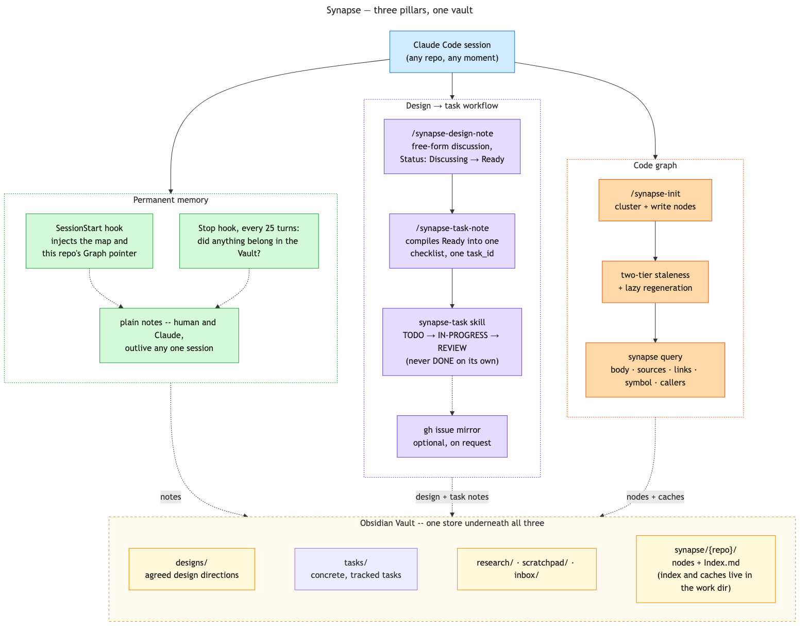

# Documentation

How the pieces of Synapse fit together, for anyone (including future-you) who wants the fuller picture
beyond the individual command, hook and skill files. Each doc below stands alone; read whichever one
matches what you're trying to understand.

- **[synapse-vault.md](synapse-vault.md)** — **Synapse Vault**: the Obsidian vault itself, its folder
  layout, and the three hooks that keep it alive across sessions (`SessionStart` injection, the `Stop`
  nudge, and vault→git auto-commit).
- **[synapse-graph.md](synapse-graph.md)** — **Synapse Graph**: the per-repo semantic code graph. The
  two-tier staleness model, `/synapse-init`, the `synapse-node` Tier 2 skill, `synapse-query.sh` (projected
  reads, so a node's exhaustive `sources` never enters a context window), the unfabricable `crux`,
  grounded summaries, opportunistic correction, the typed relation graph `links` derives, and the
  optional tree-sitter acceleration layer. Also
  the rule that keeps it language-agnostic — mechanics are scripts, interpretation is the model,
  `manifest.tsv` is the seam — and why the "never a context read" constraint is symmetric, which is
  what forces the write path to be scripted too.
- **[design-task-workflow.md](design-task-workflow.md)** — the design-note → task-note pipeline that
  runs on top of the Vault: `/synapse-design-note`, `/synapse-task-note`, the `synapse-task` status-tracking skill,
  and the optional GitHub-issue mirror.
- **[synapse-code-cache.md](synapse-code-cache.md)** — **Synapse Code Cache**: the vault-free
  acceleration layer underneath the Graph. Build path (`synapse-tags.sh` → `synapse-tags-cache.sh` →
  `synapse-build-refs.sh`) and query path (`symbol`, `synapse-callers.sh`), what each costs measured,
  and how much of the whole system turns out not to need Obsidian at all.
- **[scripts.md](scripts.md)** — reference for every **Synapse Tools** plumbing script in
  `claude/lib/synapse/` (the porcelain, `claude/bin/synapse.sh`, documents itself via `--help` instead):
  purpose, usage, arguments and exit codes. **Generated**, by `generate-scripts-reference.sh`, from the
  same header block each script prints for `--help` — so it cannot describe a script that has moved on.
  Run the generator after editing a header; `--check` is wired into the test suite. It carries no
  rationale on purpose: that belongs in the docs above, and duplicating it in two places is how the
  copies start to differ.

Diagrams live in [diagrams/](diagrams/). Each one is a Mermaid source file (`.mmd`) plus a rendered
`.png`, and the docs embed the PNG rather than a ```mermaid fence — a fence renders on GitHub but shows
up as raw source in Markview and other plain Markdown viewers, while a linked image works everywhere.

- `diagrams/synapse-overview.png` — the whole system in one picture: three equally-weighted pillars
  (permanent memory, the design→task workflow, the code graph) sharing one Obsidian Vault underneath.
  See "What a session actually gets" below for what this view is for and how it differs from the
  component breakdown above it.
- `diagrams/synapse-vault-overview.png` — the Vault and its hooks.
- `diagrams/synapse-graph-tiers.png` — the Graph's two staleness tiers and the tree-sitter layer.
- `diagrams/synapse-code-cache.png` — the Code Cache's build path (tags → tags-cache → build-refs)
  and query path (`symbol`, `callers`) in one picture.
- `diagrams/design-task-workflow.png` — the design-note → task-note pipeline.
- `diagrams/synapse-pipeline.png` — every script that owns a build or repair step, in one picture: which step each one owns,
  what it writes, and where the model's two contributions enter. Laid out as three lanes (model
  judgment / script mechanics / vault artifacts) so the seam is visible as the only place arrows cross
  from the first lane into the second. It opens `synapse-graph.md` as that doc's overview, with
  `synapse-graph-tiers.png` sitting further down in the staleness section it illustrates.

**To change a diagram, edit its `.mmd` and run `docs/generate-diagrams.sh`.** It re-renders only the
sources whose hash has moved and records each one in `diagrams/.rendered`, so `--check` — which the test
suite runs — fails if a `.mmd` was edited and never re-rendered. That matters more than it sounds: a
stale diagram is worse than a missing one, because it is confidently wrong and nothing about looking at
it says so.

The generator hashes the **source** rather than comparing PNG bytes, because mermaid-cli output is not
byte-reproducible across versions, fonts or platforms — a byte comparison would fail for reasons that
have nothing to do with the diagram.

For the same reason the renderer itself is **pinned** (`MERMAID_CLI_VERSION` in the generator, invoked
via `npx` rather than whatever `mmdc` is on `PATH`): layout, not just bytes, is version-dependent.
mermaid-cli 11.4.2 changed dagre's cycle-breaking and rearranged `synapse-pipeline.mmd` into a shape
with a large empty quadrant. That matters beyond looks, because GitHub renders a committed `.mmd`
natively in its file view — so every diagram here is on display twice, as that render and as the linked
PNG, and the two must not disagree.

Two things worth knowing if you edit one: mermaid puts edge labels at the midpoint, so a long label on
a crossing edge lands on top of a box (keep labels to two or three words and put detail inside the
node); and a `subgraph` draws a cluster box that can enclose nodes you did not put in it, which reads
as containment that is not there. Where grouping matters, colour is the safer carrier — every diagram
here declares its palette with `classDef` and includes a legend.

## The three components, and why they are separate

Synapse is three things sharing one host and one consumer — the Vault stores everything, and Claude
Code is the only thing that reads it:

- **Synapse Vault** is the durable, cross-project knowledge base: notes that outlive any one session or
  repo.
- **Synapse Graph** is a per-repo accelerant layered on top of it. Instead of re-exploring a codebase
  from scratch every session, Claude Code gets a small, LLM-authored map of it, stored the same way any
  other note is.
- **Synapse Tools** are the scripts, commands, skills and hooks that build and maintain both — and the
  only part this repository actually ships.

The Vault and the Graph do not require each other. A project can use the Vault without ever running
`/synapse-init`; a design note can conclude as `Reference` with no task attached; the Graph does not
care whether the repo it is initialized in has any notes at all. The Tools are what make either usable
from inside a session, which is why the constraint that shapes them — a node's exhaustive `sources` can
neither be read into a context window nor emitted from one — ends up dictating so much of the design.

## What a session actually gets

The breakdown above describes what the three components *are* — a store, an accelerant layered on it,
and the scripts that build both. This is the complementary view: what a Claude Code session actually
*gets* out of using Synapse at all, as three capabilities rather than three components.



- **Permanent memory** — notes that survive past the session that wrote them, surfaced automatically
  (`SessionStart`, the `Stop` nudge) rather than left to be remembered unprompted.
- **A design → task workflow** — free-form discussion that only becomes a tracked checklist once it's
  actually ready to build, with status tracked separately from the discussion that produced it.
- **A code graph** — efficient codebase search and, since sb-005, exact per-symbol lookup, both scoped
  to stay cheap regardless of a node's size.

The three pillar boxes are drawn the same size on purpose. The code graph is the most mechanically
elaborate of the three by a wide margin — two staleness tiers, tree-sitter acceleration, a tags cache
with parallelized backfill — but conceptually it is one benefit among three, not the main event with
two footnotes attached. A diagram sized to match that mechanical complexity would say something about
Synapse's implementation effort that isn't true of its actual value split, which is the reason this
view exists as its own diagram rather than being folded into `synapse-pipeline.png` above.
