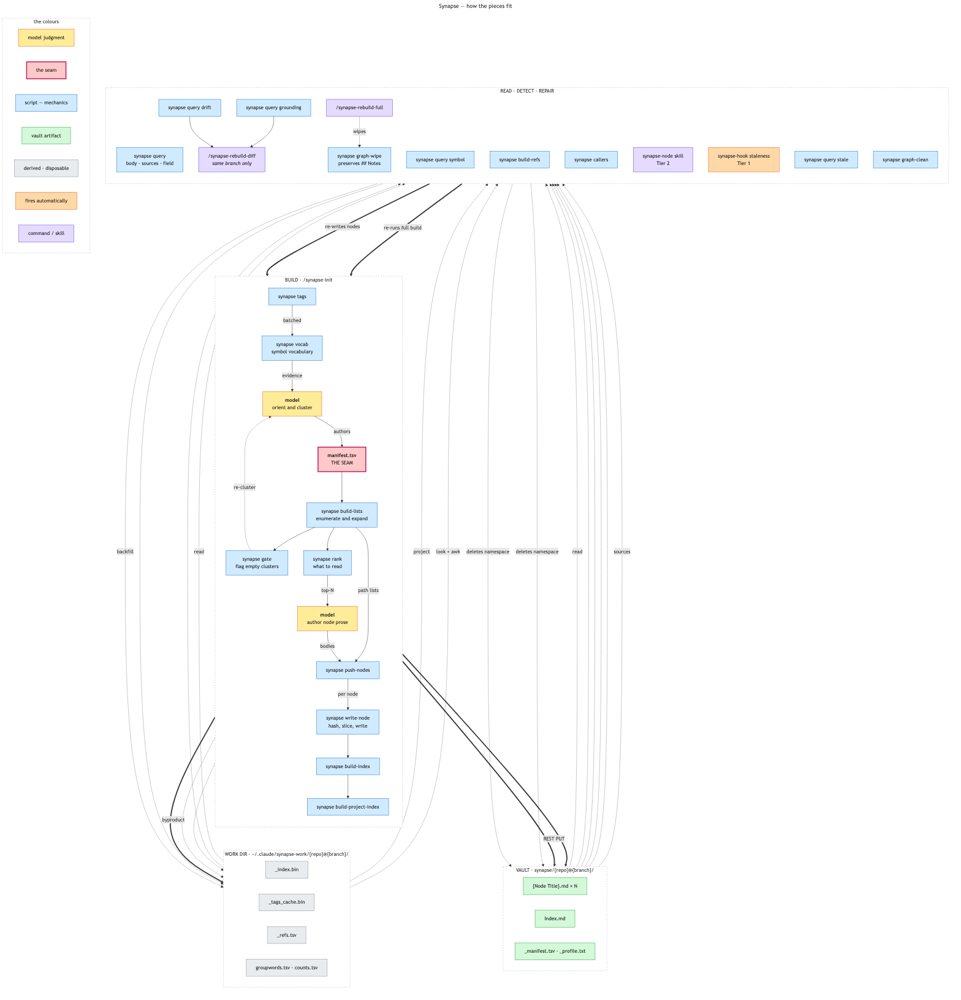
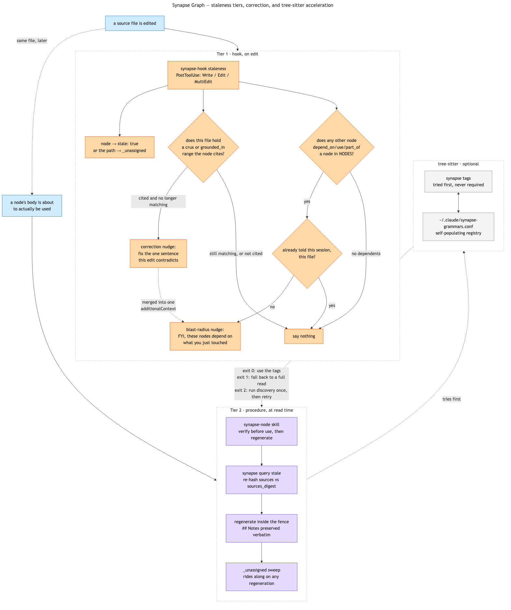

# Synapse Graph: the per-repo code graph

Claude Code re-explores a codebase from scratch every session — grep a term, open a file, follow
an import, back out, try again — and whatever it learns dies with the session. The Graph is a small,
LLM-authored map of a repo's subsystems (summary + crux + typed links per concept), hosted in
[Synapse Vault](synapse-vault.md) instead of a repo-local folder, so it's global across every project
and searchable the same way any other note is. It's inspired by
[NanoNets/Graft](https://github.com/NanoNets/Graft) but deliberately much smaller in scope — single
consumer (Claude Code only), no multi-agent wiring, no standing CLI surface.

The boxes carry names; what each one does is here rather than inside the box, because a rectangle
holding four lines of mechanism cannot be read at a glance — which is the only thing a diagram does
better than prose.

| Box | What it does |
|---|---|
| `synapse vocab` | Reduces the repo to `group ⇥ word ⇥ count` from symbol names alone. The orientation evidence, derived rather than explored. |
| **model** — orient and cluster | Reads the vocabulary table and decides what the nodes should be. The one genuinely judgment-shaped step in a build. |
| `synapse gate` | Flags a cluster whose top terms are all corpus-common — it owns no vocabulary, so it is not a concept. Runs before any prose is paid for. |
| `synapse rank` | Which of a cluster's files are worth reading, in tiers. Reading order only; `sources` stays exhaustive. |
| **manifest.tsv** — the seam | `title ⇥ include-ERE ⇥ exclude-ERE`, one line per node. The single artifact the model hands to the scripts, and the reason coverage comes out as a printed number rather than a claim. |
| `synapse build-lists` | `git ls-files` → `all.txt`, then expands each manifest line into a path list. Prints enumerated / covered / unassigned. |
| **model** — author node prose | Writes one body per node: summary, a crux *pointer* (never the code itself), links, and any `grounded_in` pointers. |
| `synapse push-nodes` | Loops the writer over every node that has both a path list and a body. |
| `synapse write-node` | Hashes every path, computes `sources_digest`, slices the crux out of the file from its pointer, digests each `grounded_in` range, builds the `## Sources` mirror, records `commit`. |
| `synapse build-index` | Builds `_index.bin`, the reverse index the Tier 1 hook reads. |
| `synapse build-project-index` | Builds `Index.md`, reading each bullet's headline back off the node's own `summary`. |
| `synapse tags` | tree-sitter definitions and references, used as a clustering signal. Falls back to plain reading when a grammar is unavailable. |
| `{Node Title}.md × N` | The nodes: `sources`, `sources_digest`, `commit`, `crux_path`, `grounded_in`, `stale`, fenced prose, and a human `## Notes` preserved across regeneration. |
| `_index.bin` | Source path → owning node filenames, plus the unassigned list. Machine-only, in the work dir. |
| `Index.md` | The node map, plus the `remote` and `branch` identity fields verified before any read or write. |
| `_manifest.tsv` · `_profile.txt` | Kept for the next rebuild. |
| `_tags_cache.bin` | `path → {hash, tags, unsupported}`. Machine-only and never authoritative — so it lives in `$SYNAPSE_WORK_DIR`, not the vault. |
| `synapse query` | Projected reads — `body`, `sources`, `field`. Reads the expensive parts internally and prints only what was asked for. |
| `synapse query symbol` | Exact-name definition and reference lookup: a cache read, with a lazy parallel backfill on a miss. |
| `synapse-node` skill | Tier 2 — verify at read time, then regenerate lazily. |
| `synapse-hook staleness` | Tier 1 hook — sets `stale: true`, and asks for a correction when cited evidence stops matching. |
| `synapse query stale` | Re-hashes what a node claims. Cannot see additions, and reads a rename as a deletion. |
| `synapse query drift` | Diffs `commit..HEAD`. The only thing that sees added paths, deletions, renames and a divergent baseline. |
| `synapse query grounding` | Re-slices cited evidence: moved → re-point, changed → re-check. |
| `/synapse-rebuild-diff` | Triage per node — reseat, patch from the diff, or re-orient. Same-branch only. |
| `/synapse-rebuild-full` | Wipes the namespace and rebuilds it via `/synapse-init`, preserving and auto-merging back `## Notes`. |
| `synapse graph-wipe` | Deletes the current namespace after preserving `## Notes` to a scratchpad staging note. The delete half of `/synapse-rebuild-full`. |
| `synapse graph-clean` | Removes a namespace whose upstream branch is gone; reports anything it cannot confirm. Run deliberately, never fired by a hook. |

The whole system in one picture, and the layout carries an argument. Three lanes — what the **model**
judges, what a **script** executes, what lands in the **vault** — because the division between the
first two is the design rule everything else follows from, and drawn this way it is visible rather
than asserted: arrows cross from the model lane into the script lane in exactly two places,
`manifest.tsv` and the authored `b-NN.md` prose bodies. Every other step of a build is mechanical and
never leaves the script lane. The four phases read left to right and top to bottom — build, then read,
then detect, then repair — and the repair arrow closes the loop by returning to
`synapse write-node`, which re-records each node's `commit` and so sets the baseline the next
`drift` measures against. Per-subcommand usage and exit codes are in [cli.md](cli.md); the
sections below are the reasoning.

## Dormant until opted in

A project has no Synapse namespace at all until `/synapse-init` is run inside it, deliberately.
Every other Synapse mechanism's cost is gated behind that namespace existing — the `SessionStart`
hook's check is a plain path lookup, never a model call, so a project that never opts in pays
nothing, forever.

More precisely, a **repo and branch pair** has none until it is built there: a namespace is keyed
`synapse/{repo}@{branch}/`. The repo half comes from the remote's basename rather than the directory,
so a linked worktree and its parent checkout agree; the branch half from `git symbolic-ref --short
HEAD`. Both are resolved in one place, `src/core/identity.zig`, because five components have
to agree about which namespace a checkout belongs to and a second derivation is how they stop
agreeing.

Worktrees therefore need no handling of their own. Git refuses to check out one branch in two
worktrees of a repository — the main checkout included — so a branch already names at most one
checkout. That removes rather than solves a pile of mechanism: no `.git`-file parsing, no `commondir`
walking, and no need to tell a linked worktree from a submodule, whose on-disk shapes are identical.
A detached HEAD has no branch and so gets no namespace, stated rather than silently keyed under the
literal string `HEAD`, which every detached checkout everywhere would share.

The cost of that choice is paid at creation and nowhere else: each branch worth a graph pays a full
cold build, and a branch not worth one simply has no namespace. What it buys is that `commit`, the
per-file hashes and `stale` all describe a single tree, so a branch switch invalidates nothing — the
graph you built on the mainline keeps describing the mainline.

## Namespace end-of-life

Branches are deleted, so their namespaces reach end-of-life routinely rather than exceptionally.
`synapse graph-clean` removes the ones whose upstream is gone — what `git branch -vv`
reports as `[origin/x: gone]` — after a `git fetch --prune`, without which a deleted branch still has
a local tracking ref and the command silently finds nothing to do.

It is a command you run, never a hook that fires, and that asymmetry is deliberate: every other
automated component here *reports* and leaves acting to a deliberate step (Tier 1 flags and never
regenerates; the correction nudge nudges and never fixes), and this is the only tool that destroys
notes. It also errs consistently toward keeping them. Anything it cannot positively confirm is
reported instead of removed — a branch absent locally whose upstream config went with it, or a
namespace with no `branch` field. A failed fetch is non-fatal and leaves everything looking alive. In
a repo with no remote there is no upstream to consult at all, so the test falls back to local branch
existence; without that fallback the first run in such a repo would read every namespace as
deleted-upstream and wipe the lot.

The branch it checks comes from the namespace's own `branch` field, never from the directory name:
that name has `/` translated to `-`, which is not reversible — `feature-CORE-1` could be
`feature/CORE-1` or a branch literally named that.

Removal is discard, not promotion. A branch namespace is a working copy; the trunk's namespace is the
durable record, and its ordinary drift handling is what carries merged work forward. The corollary is
a convention rather than a mechanism: only the trunk namespace is linked to from elsewhere in the
vault, and a `## Notes` section worth keeping belongs there, because anything written on a branch
namespace dies with it. That is also what makes deletion safe — nothing links into it.

## `/synapse-init`: first build

Walks the repo's tracked files (`git ls-files`, so `.gitignore` exclusion is free), runs an
orientation-then-clustering pass biased by `CLAUDE.md`/`README.md` if present (hints, never
authoritative structure), gates the resulting clusters on whether each owns any vocabulary of its
own, and writes:

- One node file per subsystem/concept — a few dozen per repo, not one per file — under
  `synapse/{repo}@{branch}/{Node Title}.md`. Each carries `sources` (**every** file the node covers, as
  a repo-relative path + `git hash-object` fingerprint), `sources_digest` (sha256 over the `LC_ALL=C`
  sorted `path:hash` lines, so "has this node changed" is one comparison rather than N), a
  plain-English `summary`, a `crux` (the few lines that carry the actual logic — **authored as a
  pointer, stored as text**; see "The crux is sliced, not typed" below), typed `links` to other nodes,
  an aggregated
  `## Sources` mirror, and a `## Notes` section preserved verbatim across every future regeneration.

- `_index.bin` — a derived, machine-only reverse index (source path → owning node filenames, plus
  an `_unassigned` bucket for anything not yet claimed) that the cheap staleness hook can look up
  directly, without reasoning about anything.
- `synapse/{repo}@{branch}/Index.md` — the human/Claude-facing map: node titles, one-line summaries
  read back from each node's own `summary` frontmatter field (so the index cannot describe a node as
  it used to be), file counts, and the identity fields `remote` (the repo's git remote, or its
  absolute path if it has none) and `branch`, verified together before anything reads from or writes
  into the namespace.

Re-running it on an already-initialized project doesn't rebuild anything — it's just the manual
fallback for sweeping the `_unassigned` bucket, for a repo that's gone fully dormant with no other
regeneration event to piggyback the sweep onto.

### Mechanics are scripts; interpretation is the model. `manifest.tsv` is the seam.

The division that keeps Synapse language-agnostic, and the test for where any future piece belongs:

- **Mechanics — fixed, language-agnostic, tested.** Enumerating and proving coverage
  (`synapse build-lists`), hashing + `sources_digest` + the `## Sources` mirror + the PUT
  (`synapse write-node`, driven by `synapse push-nodes`), the reverse index
  (`synapse build-index`), the project index (`synapse build-project-index`), and reading it
  all back (`synapse query`). These have exact contracts — the digest definition must match
  across the writer and the verifier or every node reports a false mismatch — and none of them can
  know or care what language the repo is in.
- **Interpretation — the model, and only the model.** What the nodes *are*, and what their prose
  says. There is no language-neutral way to answer "where does meaning live in this tree": Java says
  packages and `*Service` suffixes, Rust says crates and `pub`, Go says packages and exported
  identifiers, Elixir says `defmodule`. A shipped script would have to pick one and be wrong
  everywhere else.

**`manifest.tsv` (`title <TAB> include-ERE <TAB> exclude-ERE`) is the interface between the two.**
Judgment enters as a few dozen regexes; everything downstream is mechanical and verifiable, which is
why coverage is a printed number rather than a claim. It also makes the judgment reviewable and
re-runnable — a human can read 48 titles and regexes, and a later extension starts from the manifest
instead of re-deriving the clustering.

A corollary: **the "never a context read" rule is symmetric.** On a large monorepo a namespace runs
to megabytes of node frontmatter and an `_index.bin` in the tens of megabytes — quantities a model
can no more *emit* into tool calls than *read* into a window. That, not tidiness, is why the write
path is scripted at all.

It is also why **no aggregation or profiling script ships.** "What is the signal in this tree?" is
interpretation: a fixed script has to hardcode one ecosystem's conventions — JVM source roots and
`*Service` suffixes, say, or Rust crate paths — and is then wrong everywhere else. `/synapse-init`
carries a checklist instead (where is the weight, what artifact dominates, what does the code call
itself versus what its directories call it, what are the domain's verbs), plus the instruction to
record the aggregations that earned their keep in `synapse/{repo}@{branch}/_profile.txt`. Same pattern as
`synapse tags` with its `~/.claude/synapse-grammars.conf` registry: ship the language-agnostic
primitive, let the per-language or per-repo specifics be discovered and cached.

### Three per-repo artifacts, in two places

- **`~/.claude/synapse-work/{repo}@{branch}/`** — the work directory (`manifest.tsv`, `all.txt`,
  `lists/`, authored node bodies, coverage files). Persistent, so a later run finds
  the previous clustering. Deliberately *not* the repo — these scripts run from inside the repo, so a
  `$PWD` default would drop megabytes of working files into a user's checkout — and *not* the vault,
  which would put a six-figure-line file list into Obsidian's search index.
- **`synapse/{repo}@{branch}/_manifest.tsv`** — the clustering, copied into the vault because it is inert
  data describing the graph, and a second machine should be able to extend the namespace without
  re-deriving it.
- **`synapse/{repo}@{branch}/_profile.txt`** — the aggregations that proved useful for this repo, as
  fenced commands with a line each on what they revealed, plus the **negative results** (a search
  that came back empty is knowledge, and is the one thing a saved script cannot hold). **Read, never
  executed:** vaults get synced, shared and restored from elsewhere, and "fetch code from the notes
  vault and run it" is not a pattern worth establishing for something a model re-issues in seconds.
  The knowledge worth keeping was never the bash — it was which aggregation to run and what it showed.

Two conventions in those names, and only one of them does anything. The **extension** is load-bearing:
Obsidian indexes `.md` as notes, so anything ending `.md` shows up in search, Quick Switcher and the
graph, while a `.txt`/`.tsv`/`.json` sibling is invisible to all three and still fully readable by the
tooling. The **`_` prefix does
nothing mechanically** — Obsidian has no notion of it; it is purely a signal to a human who sees the
file in the explorer that nothing here is hand-edited. Dotfiles would hide these from the file
explorer too, but that hides them from *you* as well, and some sync tools skip them — a poor trade for
a file whose whole purpose is surviving to another machine.

**Sampling used to be required here, and no longer is.** `synapse tags` ran one file per
invocation (~0.07s warm), which put a 15k-file cluster at ~18 minutes and a whole repo out of
reach — so any use of it needed a sampling rule, and every fixed rule was biased in a way that had
to be chosen and defended (alphabetical is an accident, largest-file favours generated code,
"under `api/`" bakes in a naming convention the repo may not share, most-referenced needs the full
scan being avoided). `--paths` removed the cost that forced the choice: one invocation for a whole
list measured 33× on 200 files, and `synapse vocab` now covers 98k code files in ~51s. There is
no sampling rule anywhere in the pipeline, and reaching for one is a sign of running the wrong
command.

### `sources` is a machine field; `## Sources` is its human mirror

Worth stating plainly, because conflating the two produces a real bug — trimming `sources` to a few
"representative" files per node to keep the frontmatter readable:

- **`sources` is exhaustive, and read by machines only.** It is what Obsidian's search index turns
  into a file → node lookup: searching a class name that appears in no node's prose still finds the
  owning node, because the path is in that list. Trimming it silently destroys that lookup, leaves a
  node unable to answer "which files am I about", and reduces verification to whatever survived the
  trim. Its unreadability in Obsidian's Properties panel is not a reason to trim it — that is what
  the mirror is for.
- **`## Sources` is aggregated, not enumerated**: one line per owning directory/module with a file
  count. A node covering 941 files would otherwise put 75 KB of paths in front of a reader who wants
  to know which modules are involved. The aggregation key (`module_of()` in `synapse query`,
  re-implemented identically in `synapse write-node` -- the two must never drift) is everything
  before a path's first `/src/`, *except* for a configured list of boilerplate chains
  (`~/.claude/synapse-module-boilerplate.conf`, seeded with Maven/Gradle's `src/main/java`,
  `src/test/java`, `src/main/resources`) which strip through to the segment before `src/` entirely.
  The distinction matters: Maven's `src/main/java/...` carries no subsystem information of its own,
  but a flat `<pkg>/src/<subsystem>/...` layout (OCaml, Rust, Go, ...) has no such boilerplate -- the
  segment right after `src/` *is* the subsystem, so collapsing it the same way erases the one
  distinction the mirror exists to preserve. Add a repo's own conventions to that config file rather
  than special-casing them in the scripts.
- **`## Notes` is human-authored only.** Claude never writes there, at build or regeneration.
- Everything the generator owns sits between `<!-- synapse:generated:start -->` and
  `<!-- synapse:generated:end -->`. Regeneration replaces only the bytes between those markers and
  re-emits everything outside verbatim — which is the mechanism behind the `## Notes` guarantee.
  Without a fence, "preserved verbatim" is a promise with nothing enforcing it.

### The crux is sliced, not typed

The body never contains crux code. It carries a directive — `<!-- crux: path/to/file.ext 412-419 -->`,
or `<!-- crux: none -->` — and `synapse write-node` cuts those lines out of the file, fences them with
a language guessed from the extension, appends a `path:start-end` provenance line, and records
`crux_path`/`crux_lines` in frontmatter. The write is refused if the path is not one the node claims, if
the range runs off the end of the file, or if the span reaches 20 lines.

This is the difference between a rule and a mechanism. A crux a model *types* can be a paraphrase that
merely looks like a quote — something shaped like code, citing nothing, indistinguishable from a real
quote to anyone who does not go and check. An instruction to quote rather than compose depends on
compliance and cannot be verified; a crux the *script* cuts cannot be composed at all. It is the
mechanics-are-scripts split that `manifest.tsv` draws for clustering, applied to the field where
fabrication is easiest and least visible: the model points, the script quotes.

The pointer is authored and the text is stored, which buys both properties at once. Line numbers decay
as a file changes, so a node holding only `412-419` would come to cite something else; resolving the
pointer at write time and keeping the result is unfabricable when authored and immune to line drift
afterwards. `crux_path`/`crux_lines` stay in frontmatter so a rebuild can re-slice deliberately instead
of carrying an old quote forward — `/synapse-rebuild-diff` reconstructs the directive from them.

`none` is a first-class answer, for a trivial data holder, a one-line delegation, or logic spread evenly
across a subsystem with no focal span. A required field with no honest answer is how an invented one
appears, so the format provides a way to say there isn't one.

### Grounded summaries: evidence recorded as a checkable field

The crux is mechanically checkable; the prose around it is not, and the prose is most of a node. A
summary can assert a mechanism that is simply untrue, and regeneration preserves every sentence a diff
does not contradict — so a claim that was never true is never contradicted by anything.

A summary therefore points at its evidence. Any number of `<!-- grounded_in: path start-end -->`
directives name what the codebase asserts about itself, in preference order: a **test** (its name and
assertions describe behaviour CI re-checks on every commit, the strongest evidence short of running the
code), a **doc comment** (the author's own claim of intent), then plain reading. A claim traced to either
is one the codebase makes; even a *wrong* doc comment beats an invented explanation, because it is
attributable and findable.

The writer records each as `path` + `lines` + sha256 **of the sliced text** in a `grounded_in`
frontmatter list, and strips the directives from the body. This is provenance rather than display: six
groundings rendered as six code blocks would bury the prose a reader came for. Storing only the digest
keeps the field small, avoids escaping multi-line code into YAML, and makes verification mechanical.
The digest covers the *slice*, not the file, so a change elsewhere in that file leaves the grounding
intact — a far sharper signal than what fraction of a node's lines moved.

`synapse query grounding` re-slices every recorded range and compares:

- **silence** — the evidence still says what it said, so nothing has undercut the prose;
- **`grounding moved: path 1-2 -> 3-4`** — byte-identical text at a new offset, because something was
  inserted above it. Fixable by re-pointing, no reading required;
- **`grounding changed: path 1-2`** — the evidence itself differs. The claim resting on it needs a look.

The *moved*/*changed* split is what makes the check worth running rather than ignoring: without it, one
inserted line near the top of a file reports every grounding below as broken, and a check that cries
wolf gets tuned out. A mismatch is a prompt to re-read one span, never proof the summary is wrong — the
judgement stays with the model, the mechanics stay in the script.

Grounding is **partial**. Architectural narrative and findings that came out of debugging have no test
asserting them; they cannot be cited, and should not be watered down to become citable. It is also
**node-level**: a failure says something this node claims may have moved, not which sentence.

### Opportunistic correction: the graph self-heals where work happens

Checking a namespace with `grounding` is a deliberate act. The `PostToolUse` hook is where the same
check costs nothing: it already fires on every `Write`/`Edit`/`MultiEdit`, already resolves which nodes
claim the edited file, and is the one point where the code has certainly just been read.

So alongside flagging `stale: true`, the hook re-verifies the evidence those nodes cite **in the file
just edited** — the range the `crux` was sliced from, and any `grounded_in` entry pointing there. If the
cited range still matches, it says nothing. If it stopped matching, it returns a nudge naming the node
and the evidence, and asks for the one sentence the edit contradicts to be fixed.

The narrowness is what makes it work. A nudge on any edit to any of a node's files would fire on nearly
every edit in a repo of real size and be tuned out within a day, taking the rare meaningful one with it.
A nudge only when explicitly cited evidence stops matching fires rarely and means something each time.
Two consequences: the check asks for no re-reading, so it is free; and correctness accrues along the
paths being worked in, while dormant subsystems stay as vague as they were — which costs nothing,
because nothing is reading them either.

The nudge carries its own guardrail: correct only what this edit contradicts, never re-read the node's
other sources, never verify its remaining claims, never start a sweep. Sweeping is `/synapse-rebuild-diff`'s
job, and a free habit that turns into an expensive one stops being worth having. A node already flagged
`stale` is still checked — it has had the longest to go wrong, so skipping it would hide the case most
worth catching.

Tier 1 therefore answers two questions rather than one: whether something under a node changed, and —
for the narrow slice it can see — whether a specific claim may no longer hold.

### Blast radius: a second, broader nudge from the same hook

The nodes claiming the edited file (`NODES` above) answer *ownership* — who documents this file —
not *impact* — who else might be affected by changing it. The hook answers the second question too,
cheaply, from data it already has: which other nodes have a typed relation (`depends_on`/`uses`/
`part_of`/etc) pointing *at* one of `NODES`, via the same scan `links --inbound` uses (see "Relations
between nodes" below) — one `awk` pass over every node file in the namespace, no per-file forks.

This nudge is deliberately looser than the correction nudge above — it fires whenever dependents
exist at all, not only when something specific broke — so it needs its own narrowing to avoid the
same "fires constantly, tuned out" failure the correction check was built to avoid. It fires **at
most once per file per session**: the first edit to a file whose node has dependents gets told;
later edits to the same file in the same session stay silent, tracked in a small marker file keyed
by the hook's own `session_id`. A fresh session re-learns it once.

When both checks have something to say about the same edit, they're merged into a single
`additionalContext` — the hook never emits two separate outputs for one edit.

### Relations between nodes, derived rather than stored

A node's `## Links` section records typed relations — `- depends_on [[Other Node]]`, `uses`, `part_of`.
Obsidian's own link graph is untyped: it knows Alpha links to Beta, not *why*, because the relation word
is prose on the line. So `synapse query links` derives the typed graph from the node files:

    links <node>              outbound, relation<TAB>target
    links <node> --inbound    what points here, relation<TAB>source
    links <node> --closure    every node reachable outbound, depth<TAB>node
    links --check             targets that resolve to no node

There is deliberately **no cached `_relations.json`**. A namespace is node-scale here, not file-scale —
a few dozen nodes and a couple of hundred edges is kilobytes, derived in about a tenth of a second — so
a cached projection would be a fourth artifact needing rebuild after every write, misleading silently
once stale, in exchange for a saving of nothing. Caching earns its keep when derivation is expensive;
this is the case where it does not.

`--check` is the one that pays for itself. A broken `[[wikilink]]` is a valid link to a not-yet-existing
note, so Obsidian renders it without complaint and no other check notices — it used to be a manual
instruction in `/synapse-rebuild-diff` and is now a command.

The API can answer the single-hop question exactly, with `{"in": ["depends_on [[Target]]", {"var":
"content"}]}` — substring rather than tokenised, so unlike `/search/simple/` it does not return a node
whose only relation to that target is a different one. What it cannot do is transitive or aggregate:
closure needs one request per hop, and orphans, hubs and cycles are not expressible at all. That is the
gap `links` fills, and the reason it reads from disk — it is asking what the graph asserts about itself,
which is infrastructure rather than note content.

## What a session is told at startup

The `SessionStart` hook injects two things, and neither is stored anywhere:

- **A verified pointer to the cwd repo's own namespace**, emitted only when that namespace's `remote:` matches the repo's actual remote. On a mismatch it says so instead, rather than risk pointing at a different repo's graph.
- **A catalogue of every *other* namespace in the vault** (`name | remote`), because one session routinely spans several repos — a change in one landing in another — and without it only the starting repo is ever announced. A session that moves into a listed repo can consult its graph, after verifying the listed remote against that repo's own.

The catalogue is derived, never stored: the source of truth is the directory listing plus each namespace `Index.md`'s existing `remote:` field, so there is nothing to invalidate and it cannot drift from reality. A stored copy could be *wrong*; a derived one can only be absent. It also keeps this hook read-only against the vault — only `synapse-hook staleness` writes.

Cost is one `grep` fork regardless of namespace count (`-m1` stops inside each file's frontmatter), then `LC_ALL=C sort` so the injected text is byte-identical across runs and machines — collation is locale-dependent and the glob's order isn't reliably sorted, and non-deterministic context defeats prompt caching. Deliberately `grep` rather than `rg`: this ships to machines that may not have ripgrep, and rg measured ~2.9x slower on this workload anyway, being pure process-startup cost.

Outside any git repo there is no pointer and nothing to exclude, so the catalogue lists everything. With no namespaces at all, nothing is emitted — the zero-cost path for repos that never opted in.

## What every prompt is told

`SessionStart` injects a pointer once. `UserPromptSubmit` (`synapse-hook prompt-context`) repeats one short line on every prompt: this repo has a code graph, it has N nodes, read it before grepping, and the skills have the procedure. That is the whole payload — no search, no node list, no network call. ~80 tokens. Set `SYNAPSE_DISABLE_PROMPT_INJECTION` (any value) to turn it off entirely; the check is the hook's literal first line, so a disabled run costs nothing beyond that one test.

**It used to search, and the measurement that ended that is worth keeping.** The hook ran the prompt through `synapse-tokenizer.sh`, OR'd the surviving terms into one `regexp` clause, POSTed it to the Local REST API's `/search/` endpoint alongside a `glob` on the repo's namespace, and injected the matching node paths.

This section previously recorded the known weakness — that OR-ing every term lets one domain-ubiquitous word match most of a namespace, confirmed at 22 of ~32 nodes in one repo — and deferred: *"Fix this only if real usage shows it's actually a problem, not preemptively."* It also left open whether the feature earned a permanent place at all, to be decided from real usage rather than from a fixed answer here.

Real usage answered both. Against a medium repo (52 nodes), the prompt *"can you explain how BatchRunner dispatches work items"* returned **50 of 52 nodes** for **~1057 tokens, on every turn**. The cause was not tunable: `[Ww]ork` matched 50 nodes because it matched the substring inside `framework`, which occurs 1392 times across the namespace's `sources` lists. Word boundaries took the union only from 50 to 25 — "work" is genuinely a word in this domain. The distinctive term `[Bb]atchRunner` matched a useful 11, and was drowned by the weak one it was OR'd with.

**The verdict split the feature in two.** The search was solving a discovery problem that no longer exists: `synapse index lookup` answers path → owning node for ~15 tokens with nothing entering context, the tags cache answers symbol questions without opening a file, and `synapse query` projects exactly the field asked for. Those are *pull*, precise, and paid only when the question is about the codebase. The search was *push*, imprecise, and paid always — including on "commit and push". Reading the entire node map costs ~2500 tokens once, so the search overtook that after 2.4 turns and kept charging.

What could not be replaced by pulling is the reminder itself. A `SessionStart` injection ages out of a long session once context is compacted; a per-turn line does not, and the habit it defends against — reaching for `grep` by reflex — is exactly what the graph exists to displace. So the nudge stayed and the search went. The cost went from ~1057 to ~80 tokens per turn, and the line is now constant: same text whatever the prompt says, because it is a standing reminder rather than a result.

A consequence worth noting: the hook no longer touches the vault REST API, so it needs no cert, no API key and no plugin data. Filesystem and git only.

`synapse-tokenizer.sh` is gone, deleted during the Zig port rather than ported: the search removal above left it with no caller but the porcelain's own dispatch table, and porting dead code is worse than deleting it. Its stopword list (`~/.claude/synapse-prompt-stopwords.conf`) very much is still used — `synapse vocab` reduces symbol vocabulary through the same list, deliberately, so two mechanisms cannot disagree about what a background word is. The list is the artefact worth keeping; the script that first read it is not.

## Two-tier staleness

Both tiers answer "has content under a node changed". Neither can see a file that belongs to *no*
node, which is what `synapse query drift` is for — see "Drift" below.

**Tier 1 — `PostToolUse` → `synapse-hook staleness`.** Fires on every `Write`/`Edit`/`MultiEdit`.
Resolves the repo root **from the edited file's own directory**, not the session's cwd, so a session
spanning several repos flags the right namespace in each. Looks the edited path up in that repo's
`_index.bin`: if it belongs to one or more nodes, rewrites each one's `stale:` line to `true`; if
it's not in the index at all, appends it to `_unassigned` instead. No hashing of the node's `sources`
here — the hook already knows with certainty which file just changed, so the flagging half is pure
bookkeeping, not verification. It does hash one narrow thing: any `crux` or `grounded_in` range those
nodes cite **in this file**, so an edit that invalidates cited evidence returns a correction nudge. See
"Opportunistic correction" above for why that slice and no wider. It also checks, once per file per
session, whether any other node depends on the ones claiming this file — see "Blast radius" below.

The hook also refuses to write when the namespace's `remote:` doesn't match the repo's, using the same origin → first-listed-remote → repo-root resolution the SessionStart hook and `synapse query` use. A namespace with no readable `remote:` counts as a mismatch, not a match on the empty string: absent provenance is not permission to write. All three components must resolve the remote identically, or one refuses where another proceeds.

It sets that field by **read-modify-write** (`GET`, rewrite the one `stale:` line, `PUT`), never by
`PATCH` with `Target-Type: frontmatter`. That call is not field-local despite reading that way: it
re-serialises the whole YAML block, stripping quotes, folding long `title:` lines, and YAML-coercing
values by type inference — an all-digit `hash` comes back as `1.1111111111111112e+39`. A corrupted
hash makes `sources_digest` disagree with its own `sources` permanently, which is a false positive no
rebuild can clear.

**Tier 2 — read-time, the `synapse-node` skill.** Not a hook — a procedure Claude follows itself,
proactively, whenever a node's body is about to actually be used (not a title-only skim). It runs
`synapse query stale`, which verifies the **whole project in one pass** — one
`git hash-object` fork plus one GET per node, a second or two for a few dozen nodes — and prints one
line per stale node
with a reason (content changed, source files gone by name, no digest, node file missing), or nothing
at all when everything is current. Its exit 1 means "could not verify", not "clean".

This is deliberately a script rather than something Claude does by hand: recomputing a digest needs
the node's path list, and both places it lives are ruinous to read into context — a hub node's own
`sources` runs to ~38k tokens and the index is binary and tens of megabytes. Done in a script, the only thing reaching a
context window is the list of stale titles. Tier 2 is what catches everything Tier 1 can't see by
construction: edits made outside a Claude Code session, `git pull`, branch switches.

**Reading a node never reads its frontmatter.** Consultation wants the prose, not the path list, so
the procedure finds the closing `---` and reads from the line after it — ~900 tokens whether the node
covers 5 files or 941. A full `vault_read` of a hub node is a mistake, not merely expensive.

Regeneration re-reads the node's current sources, rewrites `summary`/`crux`/`links` and the
aggregated `## Sources` mirror (never `## Notes`, and only inside the generated fence), recomputes
every hash plus `sources_digest`, and is always announced out loud — it has real latency/token cost,
unlike the cheap detection step, so it's never absorbed silently into a read. The same event
unconditionally sweeps the whole `_unassigned` bucket too, not just entries related to whatever
triggered the regeneration — classifying each file against the existing node list and attaching or
leaving it unassigned, announcing either outcome.

## Drift: what the two tiers cannot see

Both staleness tiers verify what a node already claims. That leaves a blind spot with a hard edge:
**a file in no node's `sources` cannot be reported by a hash comparison**, because there is nothing to
compare. So a `git pull` that adds a directory, a branch switch, or a rebase can leave the graph
silently incomplete while `stale` prints nothing at all. Renames have a softer version of the same
problem — `stale` can only call a renamed file "gone", when in fact the concept is unchanged and only
the path moved.

The blind spot is widest for changes that did not come through this session, which is most of them.
Tier 1 fires on `Write`/`Edit`/`MultiEdit` and therefore never sees an IDE refactor, a colleague's
commits arriving by `pull`, a session on another machine, or generated code that the build rewrote from
a schema or a resource definition — no human or model edited those files at all. An IDE "move class"
refactor is the sharpest case, because it produces precisely the two classes the tiers handle worst: a
rename reported as a deletion, and new paths reported not at all.

`synapse query drift` closes both. Each node records the `commit` it was built from, so drift asks
`git diff --name-status -M <commit>..HEAD` and classifies the result: content changed, renamed
(*reseat sources, prose may still hold* — the one class fixable without re-authoring), gone, or added.
Added paths are split by whether the clustering patterns in `_manifest.tsv` would already claim them
on the next `synapse build-lists` run, because only the remainder needs a human-scale decision. On
a large repo that second bucket is usually empty: ordinary development adds files inside directories
existing patterns already cover.

Three deliberate properties:

- **The baseline is per node, not per namespace.** Nodes are regenerated at different times, so each
  diffs from its own build point. A namespace built in one run shares a commit, so the cost is one
  `git diff` per *distinct* baseline — one diff for a 48-node namespace, not 48.
- **It never pulls.** It reports how far behind the upstream ref already is (`rev-list --count`, as of
  the last fetch) and leaves fetching to the human. A read-only analyser that moves `HEAD` under a
  developer mid-work is one nobody trusts twice.
- **An unusable baseline says so.** No `commit` field, or a commit absent from local history after a
  force-push, dropped rebase or shallow clone, reports itself and points at `stale`. Diffing against a
  commit that is not in this history would either fail or, worse, appear to work.
- **Silence means the graph matches the worktree.** Context — how far behind the upstream ref, how many
  commits since a baseline — is printed only next to an actual finding. Being behind upstream with an
  accurate graph is a git fact rather than drift, and reporting it unconditionally would make silence
  useless as a signal. On a divergent baseline the one-directional commit count is suppressed too,
  since the divergence line already gives both sides.

Because `git hash-object` fingerprints the worktree rather than the commit, a node written from a
dirty tree has an approximate baseline — the writer warns at the time, narrowly, on that node's own
sources.

### `/synapse-rebuild-diff`: repair, and the diff-driven rule

Detection is cheap; repair is not, so the two are separate commands. `/synapse-rebuild-diff` is invoked
by a human when major *same-branch* drift is already expected — a pull, a rebase, a long absence, a
large merge landing in the current branch — and its central rule is that **new prose is computed from
the diff, never by re-reading a node's sources.** It refuses outright if the current checkout is on a
different branch than the namespace's own recorded `branch:` field; for a full rebuild from scratch,
see "`/synapse-rebuild-full`: wipe and rebuild" below. A node covering 15,000 files where 12 changed
already has prose encoding the other 14,988; re-reading them costs enormously and discards findings
the diff has nothing to say about.

That turns repair into a triage rather than a rebuild. Per flagged node:

- **Reseat** — renames only. Recover the prose from the node's own fenced region, swap in the new paths,
  read nothing. Works even on a machine that never built the namespace.
- **Patch from the diff** — a small fraction changed and the `crux` file still exists. Read the current
  prose, the `--name-status` for its changed paths, and hunks for a bounded selection; amend only what
  the diff contradicts.
- **Re-orient** — a large fraction changed, the `crux` file is gone, modules entered or left, or the
  baseline is unusable. The prose's premises are suspect, so patching would preserve a false claim;
  re-run the node's aggregations and re-author.

The diff needs the same projection discipline as `sources`: hunks across a hub node's paths over
hundreds of commits run to megabytes, so it is names first, `--stat` to size, and hunks only for the
selection.

One edge that history rewriting makes routine rather than exotic: a node's path list can become
**empty** — that subsystem does not exist on this line — and the right response is to report it and
leave the node alone, since the writer refuses an empty list and deleting the node would destroy the
human-authored `## Notes`.

A namespace is keyed by repo **and branch** (`synapse/{repo}@{branch}/`), so branches do not share
one and switching between them invalidates nothing: the mainline's graph keeps describing the
mainline, and a branch with no namespace simply has none until someone runs `/synapse-init` there.
What still reaches this command is history moving under a graph on the branch it describes — a rebase
onto a moved trunk, or a reset — which leaves the recorded baseline off the current line and produces
the same "not an ancestor of HEAD" warning a branch switch used to.

### `/synapse-rebuild-full`: wipe and rebuild

The other repair tool, for when triage genuinely isn't the right instrument — the graph has drifted
past the point where most nodes would land in *re-orient* anyway, the namespace was built badly, or a
clean rebuild is simply wanted directly. Where `/synapse-rebuild-diff` triages and never deletes a
node, `/synapse-rebuild-full` deletes the whole namespace and rebuilds it from nothing via
`/synapse-init`'s own First-time-build procedure. It doesn't care which branch is checked out beyond
the ordinary sense — there's nothing to diff against, so it just resolves `{repo}@{branch}` for
whatever's current and rebuilds that.

The one thing a wipe can't regenerate is `## Notes` — human-authored, living outside every generated
fence. `synapse graph-wipe` (the delete half, dispatched as `synapse graph-wipe`) scans for it
before touching anything, dumps any non-empty section verbatim to a scratchpad staging note, and only
then deletes — mirroring the belt-and-braces path check `synapse graph-clean` already uses as the
only other destructive tool in the system. The command layer adds one more gate on top: `--dry-run`
first, reported to the human, explicit confirmation before the real delete runs.

After the rebuild, preserved notes get one more pass: classified against the finished new node list
(the same technique the `_unassigned` sweep uses for files) and merged into whichever new node fits,
with a provenance breadcrumb since the note has lost its original context. Every placement is reported
— success as loudly as failure — because a wrong auto-placement is most dangerous exactly when nobody
mentions it happened. What doesn't find a confident home stays in the staging note for a human to
place by hand, rather than being guessed into somewhere plausible-but-wrong.

## Optional tree-sitter acceleration

`synapse tags` is a narrow, purely mechanical helper both `/synapse-init` and the
`synapse-node` skill try before doing a full read: given a file, it prints `tree-sitter tags`
output — real definitions and name-based call references, extracted by parsing, not text
guessing — cutting straight to clustering/regeneration signal without reading the file's full body.

It's optional at every layer, never a hard dependency:

- **Grammar registry** (`~/.claude/synapse-grammars.conf`) is self-populating, not hand-curated.
  The first time a never-seen file extension shows up, Claude runs a one-time discovery procedure
  (try `github.com/tree-sitter/tree-sitter-{lang}`, fall back to a web search, verify the repo
  actually ships a tags query before trusting it) and caches the result — positive or
  `{"unsupported": true}` — permanently, across every future project, not just the one that
  triggered it.
- **Exit codes are the whole contract**: `0` → tags printed, use them; `1` → not usable right now
  (no C compiler, a confirmed-unsupported language) — fall back to reading
  the file directly, silently; `2` → never-seen extension, run discovery once, then retry.
- Grammars build as native libraries, compiled with `zig cc` (or `cc`/`gcc`/`clang`) and loaded
with `dlopen`. Not WASM: consuming WASM grammars needs
  a non-default Rust build of the CLI, a worse dependency than the C compiler native grammars need).

One subtlety in reading the output: a qualified-path reference (`Acme_ecs.Foo.bar`) must not also be
counted as a bare same-package reference to `bar`, or the tags imply edges the code does not contain.

## The Code Cache: exact-symbol lookup and repo-wide callers

Node-scoped and repo-wide exact-name lookup (`synapse query symbol` and the top-level
`synapse callers`) are both built on a separate, vault-free acceleration layer — the tags
cache and the flat reference index it projects. Neither needs a graph, a node, or the vault at all.
See [synapse-code-cache.md](synapse-code-cache.md) for the build path, the query path, and what it
buys measured against a plain `grep`.
