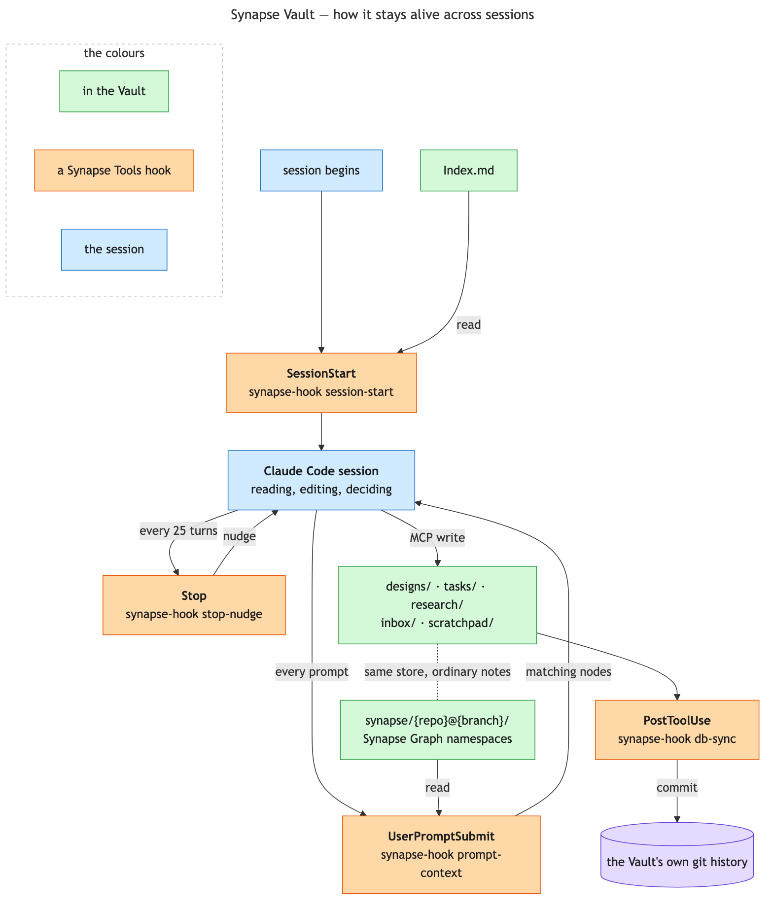

# Synapse Vault

A permanent, curated knowledge base — an Obsidian vault — that persists across every project and
every session, separate from (and complementary to) Claude Code's own `~/.claude` auto-memory
system. Auto-memory is for *how to work with this user*; the Vault is for durable, browsable notes
about the work itself.

It is also the host for [Synapse Graph](synapse-graph.md), which stores its per-repo code graphs here as
ordinary notes under `synapse/{repo}@{branch}/` rather than in a folder of their own. One store, one
search, one sync concern.

The boxes name the four hooks; what each one does is here rather than crammed inside the box.

| Hook | Fires | What it does |
|---|---|---|
| `synapse-session-start.sh` | `SessionStart` | Injects `Index.md`, this repo's Graph pointer if a namespace covers the current branch, and a catalogue of the other namespaces in the vault. A plain path lookup — never a model call, so a repo that never opted in pays nothing. |
| `synapse-prompt-context.sh` | `UserPromptSubmit` | Extracts terms from the prompt and surfaces matching Graph nodes. Set `SYNAPSE_DISABLE_PROMPT_INJECTION` to skip it. |
| `synapse-stop-nudge.sh` | `Stop`, every 25 turns | Forces a real "did anything here belong in the vault?" check-in rather than relying on the agent to remember unprompted. |
| `synapse-db-sync.sh` | `PostToolUse` | Commits vault changes to the vault's own git history on any vault-modifying write. That history is what makes a destructive mistake recoverable. |

## The vault

A regular Obsidian vault, running headless at login with the **Local REST API** plugin installed.
That plugin is the only valid way anything here talks to the vault — hooks call it directly over
HTTP (they're plain scripts, not agent turns), and Claude Code talks to it through the `obsidian`
MCP server, which just wraps the same API. Nothing here assumes a fixed vault path; the API always
targets whichever vault the running Obsidian instance currently has open.

`~/.claude/synapse.conf` holds the one piece of genuinely machine-local state:
`OBSIDIAN_VAULT_DIR`, used only as a fallback for grepping the vault as plain files if the MCP
tools are ever unreachable.

## Folder layout

Every note lands in one of these, chosen by what kind of thing it is, not what project it's about:

| Folder | What goes there |
|---|---|
| `projects/` | Dev-log notes and compiled task notes tied to a specific coding project |
| `research/` | Standalone research/reading notes, not tied to one project's dev log |
| `scratchpad/` | Throwaway or in-progress notes, not yet worth filing anywhere else |
| `inbox/` | Doesn't cleanly fit the others — reviewed periodically, meant to stay small |
| `designs/` | Cross-project design discussions (see [design-task-workflow.md](design-task-workflow.md)) |
| `synapse/` | Per-repo code-graph namespaces: node notes plus the machine-only `_index.json`, `_manifest.tsv` and `_profile.txt` (see [synapse-graph.md](synapse-graph.md)) |

Folder depth is capped at two levels. A new top-level folder requires adding a matching section to
the vault's own `Index.md` in the same action — the index is agent-maintained and must never fall
behind what's actually on disk.

## Filenames and frontmatter

Filenames are the human-readable title itself — no timestamp prefix, no slug — since Obsidian's
sidebar and graph view show the filename directly. Frontmatter carries what the filename doesn't:
`title`, `created`, and for task notes `task_id`/`status`.

## The three hooks

Nothing here runs on a schedule; everything is triggered by an actual session event.

**`SessionStart` → `synapse-session-start.sh`**
Injects the vault's top-level `Index.md` into context at the start of every session, so its
contents are live information from turn one rather than something Claude has to remember to go
read. Also does two extra cheap checks. It resolves the current repo (if any) and appends a pointer to a
matching Synapse namespace, if one exists and its `remote` field actually matches this repo. And it
lists every *other* namespace in the vault as a `name | remote` catalogue, because one session
routinely spans several repos and without it only the starting repo's graph is ever announced. Both
are derived per session and stored nowhere — see [synapse-graph.md](synapse-graph.md) for the detail.

**`Stop` → `synapse-stop-nudge.sh`**
A turn-count-based nudge, firing every 25 turns, asking: *did anything in this stretch belong in
the Vault and not get written down?* This exists because "remember to write notes" is
exactly the shape of standing instruction that's easy to silently forget under task pressure — a
periodic, mechanical prompt is more reliable than trusting recall alone.

**`PostToolUse` → `synapse-db-sync.sh`**
Fires on every vault-modifying MCP call (`vault_write`/`patch`/`append`/`delete`/`move`) and, if
the vault itself is a git repo, commits the change immediately. This is what makes the vault's own
history a usable audit trail of every note ever written or edited, without anyone having to
remember to commit it themselves.

## The standing instruction

The behavioral half of this system lives in `claude/synapse-claude.md`, installed to
`~/.claude/synapse-claude.md` and pulled into every session via one `@~/.claude/synapse-claude.md`
import line in `~/.claude/CLAUDE.md` — not a hook, but a persistent instruction Claude Code loads
every session. Split out from `CLAUDE.md` itself (rather than shipped inline) so `setup.sh` can
refresh it unconditionally on every run, the same way it refreshes a skill: `CLAUDE.md` is the
user's own file and is never overwritten, so content shipped inline there would silently stop
receiving updates the moment it diverged even slightly. Its core claim: this is
a *primary* memory system, not an optional nicety, and specific triggers (a non-trivial bug fixed,
a stated preference or decision, a milestone, research worth not redoing, a note gone stale)
obligate writing or updating a note without waiting to be asked. Linking to existing related notes
is called out as the highest-priority step — before creating anything new, search first — and a
note that's outgrowing its own scope should be split rather than left to sprawl.
