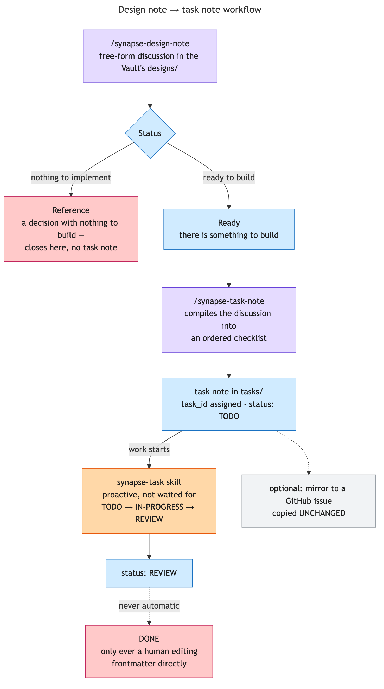

# Design Note → Task Note Workflow

How a piece of thinking turns into tracked, resumable work — a free-form design discussion that
either concludes with nothing to build, or compiles into a single tracked checklist.

## `/synapse-design-note`: the discussion

Free-form, no fixed step order — same philosophy as a private, repo-local design note, except this
one lives in the Vault's `designs/` folder instead of a repo's gitignored `docs/notes/`, so it's
findable from any project immediately. Every note carries a `project: {prefix}` frontmatter field, resolved once per project and cached
in the machine-local `synapse-projects.conf` (never committed, so personal and work
projects never end up in the same file); the title is plain `{Topic}`, and the `project:` field
decides the note's `designs/{project}/` subfolder.

A design note is created on the first substantive answer and updated after every meaningful
exchange, not batched up to the end. It concludes one of two ways:

- **`Status: Ready`** — there's something to build. The natural next step is `/synapse-task-note`.
- **`Status: Reference`** — a real conclusion with nothing to implement. Just as valid an ending;
  nothing forces every discussion toward a task.

## `/synapse-task-note`: the compile step

Reads a `Ready` design note — never invents one from scratch — and compiles its approach into an
ordered checklist of small, independently-completable steps, each written the way the `synapse-task`
skill's own convention expects (`- [ ] {Do}`, with an inline code block for any substantive
interface/signature). This command's only job is that compile step; everything about *tracking*
progress afterward belongs entirely to `synapse-task`.

The task note gets a `task_id` — the same short project prefix, zero-padded and incremented
(`{prefix}-001`, `{prefix}-030`, ...) — and a `## Notes` section populated *before* implementation
begins: a link back to the design note, the key constraints an implementor must not miss, and any
deliberate exclusions (with the reason each was excluded). After creation, the design note itself
gets a one-line `> Compiled task: [[...]]` annotation — the only place the two ever cross-reference
each other; from there, Obsidian's own backlinks panel keeps them connected.

New design and task notes declare `vault-design-note/v1` and `vault-task-note/v1` respectively.
Both carry `project`, configured `tags`, and matching second-precision local `created`/`updated`
timestamps at creation. Task notes use `task_id` as their sole stable identity and the canonical
status values `TODO`, `IN-PROGRESS`, `REVIEW`, `DONE`, and `CANCELED`; `last_updated` and
`CANCELLED` remain legacy spellings, not v1 fields or values.

## Revising a design mid-implementation

A design that turns out to be wrong once you start building it is the normal case, not a new task.
Re-running `/synapse-task-note` on the same design **updates the existing task note in place** — same
`task_id`, same filename, same `status`, and any `## Notes` a human added are preserved. Checklist
items that survive the recompile unchanged keep their `- [x]` marks, because work already done
doesn't become undone just because the plan around it grew.

The recompile records *why* it happened in one line at the top of the body. Without that, a revised
plan reads as though it was always that shape, which hides the fact that implementation found a gap
— and that gap is usually the most useful thing the task note has to say.

## `synapse-task`: status tracking

A skill, not a command — invoked proactively, not waited for. Two transitions it owns entirely:

- **Starting work** → `status: IN-PROGRESS`, no notes needed yet.
- **Finishing a pass** → `status: REVIEW` if every checklist item is checked, `IN-PROGRESS`
  otherwise — plus an implementation summary appended under `## Notes` as a dated sub-heading.

**The status never reaches `DONE` through this workflow, on purpose.** That's a human call, made
by editing the frontmatter directly — the skill's own ceiling is `REVIEW`, so "is this actually
done" always stays a decision a person makes, not one the automation reaches on its own.

## Optional: mirroring to a GitHub issue

When asked to create a GitHub issue from a task note, the mapping is direct, not reinterpreted:

- **Title** — `<task-id> — <description>`, derived straight from the note's own heading.
- **Body** — the checklist section, unchanged, straight into `gh issue create --body-file`.
- **First comment** — the `## Notes` section, unchanged, straight into `gh issue comment
  --body-file`.
- **State** — every issue is created open, then closed as a separate step only for `DONE`
  (`gh issue close`, defaulting to "completed") or `CANCELED` (`--reason "not planned"`).

"Unchanged" is the operative word — the task note is the source of truth, and the issue is a
mirror of it, not a place to re-summarize or improve the phrasing on the way out. The one
legitimate exception is dropping something that's gone stale by the time the issue is created
(e.g. a "not yet committed" note that's no longer true) rather than faithfully copying something
now-false into a public issue.
