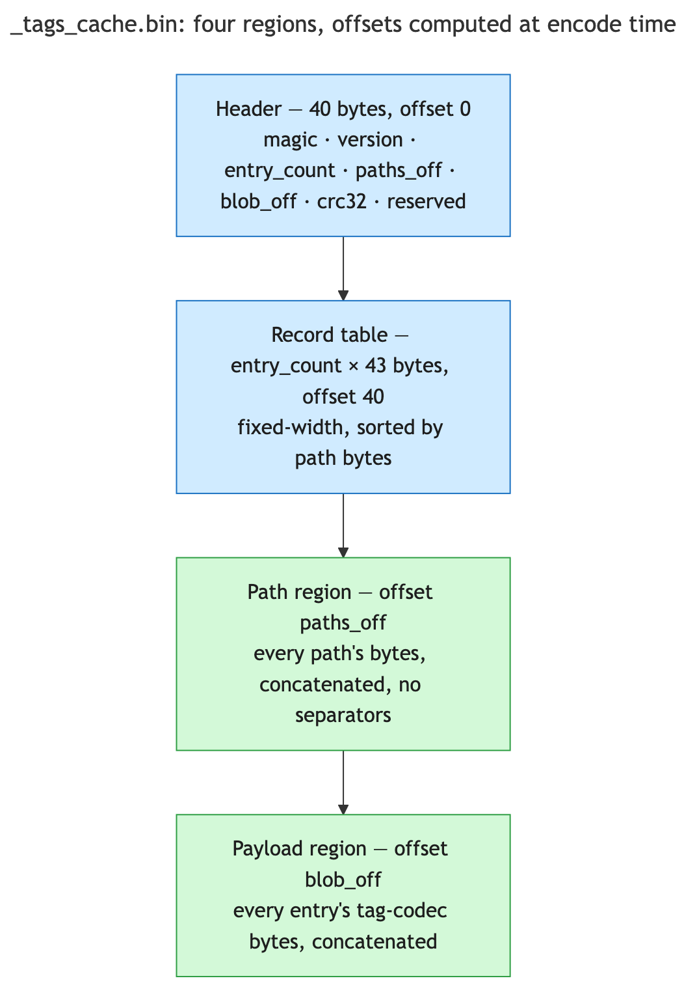
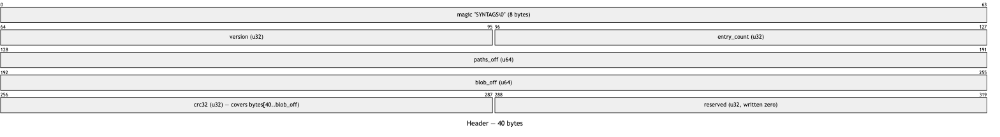
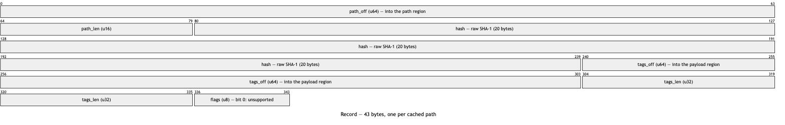
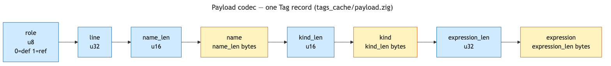

# Synapse Code Cache: on-disk format reference

[synapse-code-cache.md](synapse-code-cache.md) covers the Code Cache's build/query pipeline and why it
carries no vault or network dependency. This document is the byte-level reference underneath that: the
exact layout of `_tags_cache.bin`, the payload codec each entry's tag data is stored in, the `_refs.tsv`
row format, and the tag-line codec that sits at the tagging boundary upstream of both. Every field below
is read straight from `src/core/tags_cache/format.zig`, `src/core/tags_cache/payload.zig`,
`src/core/tags_cache.zig`, `src/core/refs.zig` and `src/core/tag_line.zig` — this document has no
content that isn't traceable to one of those five files.

## File layout



Four regions, in this order, none overlapping:

| Region | Offset | Size |
| --- | --- | --- |
| Header | 0 | 40 bytes, fixed |
| Record table | 40 | `entry_count × 43` bytes |
| Path region | `paths_off` | `paths_off` and `blob_off` are computed once, at encode time, from the actual path bytes and record count — they are not fixed constants |
| Payload region | `blob_off` | runs to end of file |

`paths_off` and `blob_off` are themselves header fields (see below), so a reader locates every region by
reading the header once and never needs to recompute an offset from `entry_count` or path lengths itself.
A gap between the record table and the path region is legal — `parse` only requires `paths_off >=
table_end`, never equality.

## Header (40 bytes)



| Field | Type | Notes |
| --- | --- | --- |
| `magic` | 8 bytes | Literal `SYNTAGS\0` — the trailing NUL is why it's 8 bytes rather than 7, so the field itself stays aligned and `head -c 8` shows the name intact. |
| `version` | u32 | Currently `2`. Bumped only when the payload region's own encoding shape changes, not the header or record layout. |
| `entry_count` | u32 | Number of records in the table. |
| `paths_off` | u64 | Byte offset of the path region. |
| `blob_off` | u64 | Byte offset of the payload region. |
| `crc32` | u32 | CRC-32 over `bytes[40..blob_off)` — the record table and path region only, **not** the payload. |
| `reserved` | u32 | Written zero, unread. Exists so the record table starts on an 8-byte boundary; the 36 bytes the fields above add to would not. |

The checksum's boundary is deliberate: bounding it at `blob_off` keeps `open` cheap regardless of how
much tag text the file holds (opening scales with `entry_count`, not with total payload size), at the
cost that a bit-flip inside a tag string is undetected until the next rebuild, while a bit-flip in any
offset in the header or record table is always caught before it can be followed.

Every multi-byte header field is written and read one at a time via an explicit `.little` — never a
`@bitCast`, `packed struct`, or struct-typed `@ptrCast` — so the file's bytes mean the same thing
regardless of the host's native endianness.

A header that fails to parse (bad magic, wrong version, truncated, bad checksum, or an offset outside
the file) is never repaired in place — the whole cache is treated as absent and rebuilt from scratch.

## Record table (43 bytes per entry)



| Field | Type | Notes |
| --- | --- | --- |
| `path_off` | u64 | Offset **into the path region** (add `paths_off` to get a file offset), not an offset into the file. |
| `path_len` | u16 | Length of this entry's path, in bytes. |
| `hash` | 20 bytes | Raw SHA-1, not hex text — half the size of a hex string, and comparable with one `memcmp`. |
| `tags_off` | u64 | Offset **into the payload region** (add `blob_off`), not an offset into the file. |
| `tags_len` | u32 | Length of this entry's encoded tag payload, in bytes. |
| `flags` | u8 | Bit 0: `unsupported` — set when the path has no usable grammar. |

The table is sorted by path bytes (`std.mem.order`) and is exactly `entry_count × 43` bytes long, which
is what makes it directly indexable (`Header.wire_size + i * 43`) and searchable with an in-place binary
search — `View.find` is the whole implementation of "does the cache hold this path, and at what index."

43 is a deliberately odd width: nothing in the record is naturally aligned, so a cast shortcut
(`@ptrCast` onto a native struct) can't quietly work on a little-endian, unaligned-tolerant architecture
and then break elsewhere. A byte-exact encoder test and a committed binary fixture
(`tags_cache/testdata/fixture.bin`) both pin this layout field by field, independent of whatever the
encoder itself produces.

`flags` bit 0 is the only thing that distinguishes "no grammar for this file" from "parsed, and declared
nothing" — the latter is a record with `tags_len == 0` and `flags == 0`, not an omitted record. Treating
those as the same case would re-attempt tagging a perfectly readable file forever.

## Path region

The concatenated bytes of every path in the table, in the same order as the table's own rows, with **no
separators or terminators between them**. A path is located purely by its record's `path_off`/`path_len`
pair — there is nothing in the region itself that marks where one path ends and the next begins.

## Payload region

The concatenated payload bytes of every entry, one after another, each exactly `tags_len` bytes long as
recorded in its entry's row. An `unsupported` entry and an entry that parsed to zero tags both contribute
zero bytes here — the record's `flags` byte is what tells them apart, not anything in this region.

### Payload codec: one Tag record (`tags_cache/payload.zig`)



A payload is a sequence of these records, back-to-back, with no framing between them beyond each
record's own embedded lengths — a decoder just keeps reading records until it has consumed the entry's
declared `tags_len` bytes.

| Field | Type | Notes |
| --- | --- | --- |
| `role` | u8 | `0` = def, `1` = ref. Any other byte value is treated as end-of-payload by the iterator, not an error. |
| `line` | u32 | Zero-based source line. |
| `name_len` | u16 | Length of `name`, in bytes. |
| `name` | `name_len` bytes | Not NUL-terminated — length-prefixed only. |
| `kind_len` | u16 | Length of `kind`, in bytes. |
| `kind` | `kind_len` bytes | |
| `expression_len` | u32 | Length of `expression`, in bytes — wide enough for a whole source line, matching `tags_len`'s own width rather than capping at anything a real line could exceed. |
| `expression` | `expression_len` bytes | |

`name` and `kind` are short identifiers, so a `u16` length is generous; `expression` is a source line
verbatim, so it gets the wider `u32`. None of the four string fields have any restriction on their
content — a name, kind, or expression containing a tab, newline, or backtick round-trips exactly, since
nothing here delimits on bytes the way a text format would. Column and end-position span data is not
part of this record at all: nothing downstream of the cache ever reads it, so there is nothing to encode.

## Validation order (`format.parse`)

Every offset a `View` accessor uses is checked once, here, so the accessors themselves perform no bounds
checking of their own. In order:

1. `bytes.len >= 40` (the header's own size), else `Truncated`.
2. The first 8 bytes equal `SYNTAGS\0`, else `NotACache`.
3. `header.version` equals the build's own `version` constant, else `VersionMismatch`.
4. `40 + entry_count * 43 <= bytes.len` (the record table fits), else `Truncated`.
5. `blob_off <= bytes.len` and `blob_off >= 40`, else `OffsetOutOfRange` — checked before the checksum,
   since a corrupt `blob_off` would otherwise slice out of bounds computing the checksum's own range.
6. CRC-32 over `bytes[40..blob_off)` equals `header.crc32`, else `ChecksumMismatch`.
7. `paths_off >= table_end` (the table and path region don't overlap; a gap is fine), else
   `OffsetOutOfRange`.
8. `blob_off >= paths_off`, else `OffsetOutOfRange`.
9. For every record, in table order: its path span fits inside the path region, its tag span fits inside
   the file, and its path sorts strictly after the previous record's path — any violation is
   `OffsetOutOfRange`.

A cache that fails any of these checks is discarded exactly the same way an absent file is: an empty,
usable cache with the failure reason recorded on the side, never a hard error. There is no partial-trust
state — a file either parses completely or it is treated as though it were never there.

## Cache lifecycle (`core/tags_cache.zig`)

- **`open`** memory-maps the file (`populate: false`, so a large mapping isn't prefaulted) and calls
  `format.parse` on it. An absent file, an empty file, and any `format.ParseError` all produce the same
  outcome: an empty, usable cache, with the reason recorded but nothing surfaced as an error. A failed
  `mmap` on a file that does exist is the one outcome tracked separately (`error.MapFailed`) — the file
  may hold real, valid data that simply couldn't be mapped this run, which is a different situation from
  "there was nothing here."
- **`needsTagging`** compares only the 20-byte `hash` field of each requested path against the record
  table — the payload region is never read. A path already held at the requested hash is filtered out;
  everything else (missing, or held at a different hash) is returned, deduplicated by path.
- **`commit`** reads every existing record into an in-memory map, applies `updates` and then `removals`
  (so removing a path that's also being updated makes the removal win), sorts the merged set by path,
  and writes it to `<path>.tmp` before renaming over the original — the rename is what keeps a concurrent
  reader from ever observing a half-written cache. Refuses outright (`error.MapFailed`) if the cache it
  would merge onto is a real file that simply failed to map, rather than silently replacing that file's
  real data with just the caller's own updates. Not lock-protected: two `commit`s racing against the same
  file both read the same starting table, and the second rename wins outright — an accepted, undefended
  race, since the cost of losing an update here is a handful of re-derivable entries, not data loss.
- **`writeRefs`** streams every record's payload through `payload.iterate` and each resulting tag through
  `tag_line.writeRefsRow`, in the record table's own path order — it does not sort; whatever writes the
  final file is what imposes `_refs.tsv`'s own sort order.

## `_refs.tsv`: the flat reference index

Not part of `_tags_cache.bin` — a separate, plain-text file, one line per tag:

```
name <TAB> def|ref <TAB> kind <TAB> path:line <TAB> expression
```

Sorted in pure `LC_ALL=C` byte order, which is what lets `core/refs.zig`'s lookup treat file order and
sort order as the same thing: `find` bisects on raw byte offsets (`firstAtOrAfter`), then walks backward
to the nearest line boundary, without ever fully parsing a line it isn't going to return. Multiple rows
can share a name — they sort contiguously, and `RowIterator.next` keeps returning rows until the name
field stops matching. `expr` is whatever remains on the line after the four leading tab-delimited fields
are split off, so it may itself contain literal tab bytes; only the line's own newline ends a row. The
index file is memory-mapped for the same reason the tags cache is — a lookup only ever faults in the few
pages its bisection actually lands on — and falls back to reading the whole file only when mapping isn't
available.

## Tag-line codec (`core/tag_line.zig`)

The boundary where a tree-sitter batch-output line becomes a `Tag`, and separately where a `Tag` becomes
one `_refs.tsv` row — distinct from `tags_cache/payload.zig`'s codec, which never touches text at all.

`parse` reads one line shaped like:

```
Token     \t | class   \tdef (15, 13) - (15, 18) `public class Token {`
```

Field 1 is the name (leading spaces/tabs/pipes and trailing spaces/tabs trimmed). Field 2 is the kind,
trimmed the same way, behind a `| ` prefix. Field 3 opens with the role text, carries a `(row, col) -
(row, col)` span (only the first row number is kept, as `line`), and the expression is everything between
the first backtick and the last one in that field — an unterminated backtick keeps the remainder as-is,
and no backtick at all yields an empty expression rather than a parse failure. Any line missing a
required piece (too few tab-delimited fields, an unrecognized role word, a non-numeric or absent row
number, or an empty trimmed name) is skipped, not rejected — batch tree-sitter output legitimately
contains lines that aren't tags at all.

`writeRefsRow` is the reverse direction and the only place `_refs.tsv`'s rendering happens: it writes a
`Tag` out as exactly `name\trole\tkind\tpath:line\texpression\n`. Column order and single-tab separators
are a hard contract, not just formatting — the file is binary-searched by raw bytes, so a row that
differs by even one byte from what a writer and a reader each expect is unfindable.

## Design invariants

- Every multi-byte field, in both the header/record layout and the payload codec, is written and read
  one at a time with an explicit endianness — no struct-shaped cast anywhere touches these bytes.
- Absence and corruption both degrade to the same outcome (an empty, rebuildable cache), with exactly one
  exception (`MapFailed`) that exists specifically to avoid treating "couldn't map a real file this run"
  as "there was nothing here."
- No accessor performs its own bounds check — `format.parse` is the single point where every offset in a
  file is validated, once, and every reader after that trusts the result completely.

## Sources

- `src/core/tags_cache/format.zig` — the `_tags_cache.bin` header, record table, and encode/parse/View.
- `src/core/tags_cache/payload.zig` — the per-entry Tag codec that fills the payload region.
- `src/core/tags_cache.zig` — the `Cache` wrapper: open, needsTagging, commit, writeRefs.
- `src/core/refs.zig` — `_refs.tsv`'s `Index`, `find`, and `writeSorted`.
- `src/core/tag_line.zig` — the tree-sitter-batch-output ⇄ `Tag` ⇄ `_refs.tsv`-row codec.
