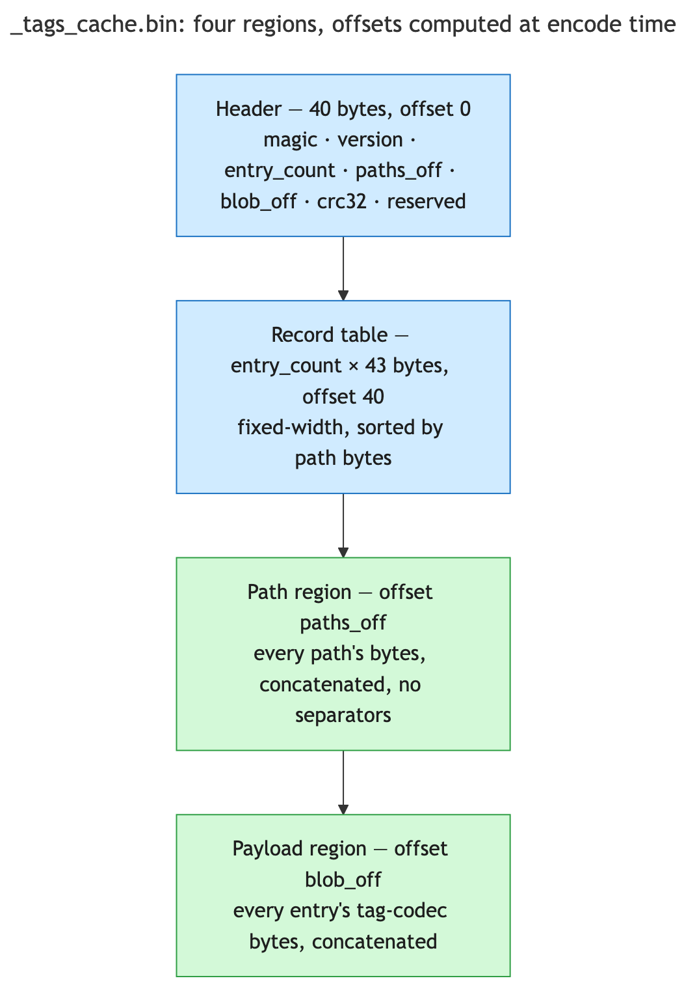
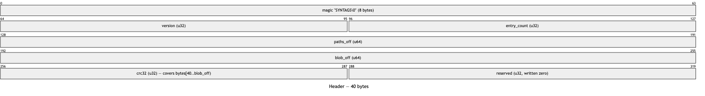
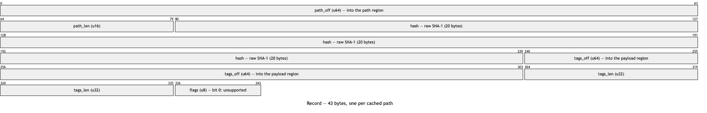
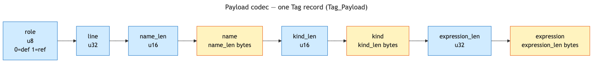

# Synapse Code Cache: on-disk format reference

[synapse-code-cache.md](synapse-code-cache.md) covers the Code Cache's build/query pipeline and why it
carries no vault or network dependency. This document is the byte-level reference underneath that: the
exact layout of `_tags_cache.bin`, the payload codec each entry's tag data is stored in, the `_refs.tsv`
row format, and the tag-line codec that sits at the tagging boundary upstream of both. Every field below
is read straight from `Synapse.Core.Tags_Cache_Format`, `Synapse.Core.Tag_Payload`,
`Synapse.Adapters.Tags_Cache`, `Synapse.Core.Refs` and `Synapse.Core.Tag_Line` — this document has no
content that isn't traceable to one of those five units.

## File layout



Four regions, in this order, none overlapping:

| Region | Offset | Size |
| --- | --- | --- |
| Header | 0 | 40 bytes, fixed |
| Record table | 40 | `entry_count × 43` bytes |
| Path region | `paths_off` | `paths_off` and `blob_off` are computed once, at encode time, from the actual path bytes and record count — they are not fixed constants |
| Payload region | `blob_off` | runs to end of file |

`paths_off` and `blob_off` are themselves header fields (see below), so a reader locates every region by
reading the header once and never needs to recompute an offset from `entry_count` or path lengths itself.
A gap between the record table and the path region is legal — `Parse` only requires `paths_off >=
table_end`, never equality.

## Header (40 bytes)



| Field | Type | Notes |
| --- | --- | --- |
| `magic` | 8 bytes | Literal `SYNTAGS\0` — the trailing NUL is why it's 8 bytes rather than 7, so the field itself stays aligned and `head -c 8` shows the name intact. |
| `version` | u32 | Currently `2`. Bumped only when the payload region's own encoding shape changes, not the header or record layout. |
| `entry_count` | u32 | Number of records in the table. |
| `paths_off` | u64 | Byte offset of the path region. |
| `blob_off` | u64 | Byte offset of the payload region. |
| `crc32` | u32 | CRC-32 over the bytes from 40 up to `blob_off` — the record table and path region only, **not** the payload. |
| `reserved` | u32 | Written zero, unread. Exists so the record table starts on an 8-byte boundary; the 36 bytes the fields above add to would not. |

The checksum's boundary is deliberate: bounding it at `blob_off` keeps `open` cheap regardless of how
much tag text the file holds (opening scales with `entry_count`, not with total payload size), at the
cost that a bit-flip inside a tag string is undetected until the next rebuild, while a bit-flip in any
offset in the header or record table is always caught before it can be followed.

Every multi-byte header field is written and read one byte at a time, least significant first — never
through a record representation clause or an unchecked conversion — so the file's bytes mean the same
thing regardless of the host's native endianness.

A header that fails to parse (bad magic, wrong version, truncated, bad checksum, or an offset outside
the file) is never repaired in place — the whole cache is treated as absent and rebuilt from scratch.

## Record table (43 bytes per entry)



| Field | Type | Notes |
| --- | --- | --- |
| `path_off` | u64 | Offset **into the path region** (add `paths_off` to get a file offset), not an offset into the file. |
| `path_len` | u16 | Length of this entry's path, in bytes. |
| `hash` | 20 bytes | Raw SHA-1, not hex text — half the size of a hex string, and comparable with one `memcmp`. |
| `tags_off` | u64 | Offset **into the payload region** (add `blob_off`), not an offset into the file. |
| `tags_len` | u32 | Length of this entry's encoded tag payload, in bytes. |
| `flags` | u8 | Bit 0: `unsupported` — set when the path has no usable grammar. |

The table is sorted by path bytes and is exactly `entry_count × 43` bytes long, which
is what makes it directly indexable (`Header_Size + i * 43`) and searchable with an in-place binary
search — `Tags_Cache_Format.Find` is the whole implementation of "does the cache hold this path, and at what index."

43 is a deliberately odd width: nothing in the record is naturally aligned, so a representation-clause
shortcut can't quietly work on a little-endian, unaligned-tolerant architecture and then break
elsewhere. A unit test that compares the encoder's output byte for byte against an independently
written fixture pins this layout field by field, independent of whatever the encoder itself produces.

`flags` bit 0 is the only thing that distinguishes "no grammar for this file" from "parsed, and declared
nothing" — the latter is a record with `tags_len == 0` and `flags == 0`, not an omitted record. Treating
those as the same case would re-attempt tagging a perfectly readable file forever.

## Path region

The concatenated bytes of every path in the table, in the same order as the table's own rows, with **no
separators or terminators between them**. A path is located purely by its record's `path_off`/`path_len`
pair — there is nothing in the region itself that marks where one path ends and the next begins.

## Payload region

The concatenated payload bytes of every entry, one after another, each exactly `tags_len` bytes long as
recorded in its entry's row. An `unsupported` entry and an entry that parsed to zero tags both contribute
zero bytes here — the record's `flags` byte is what tells them apart, not anything in this region.

### Payload codec: one Tag record (`Tag_Payload`)



A payload is a sequence of these records, back-to-back, with no framing between them beyond each
record's own embedded lengths — a decoder just keeps reading records until it has consumed the entry's
declared `tags_len` bytes.

| Field | Type | Notes |
| --- | --- | --- |
| `role` | u8 | `0` = def, `1` = ref. Any other byte value, or a length that runs past the end of the payload, ends the payload at that record: `Next` returns none and a corrupt payload never has garbage read as the framing of the next record. |
| `line` | u32 | Zero-based source line. |
| `name_len` | u16 | Length of `name`, in bytes. |
| `name` | `name_len` bytes | Not NUL-terminated — length-prefixed only. |
| `kind_len` | u16 | Length of `kind`, in bytes. |
| `kind` | `kind_len` bytes | |
| `expression_len` | u32 | Length of `expression`, in bytes — wide enough for a whole source line, matching `tags_len`'s own width rather than capping at anything a real line could exceed. |
| `expression` | `expression_len` bytes | |

`name` and `kind` are short identifiers, so a `u16` length is generous; `expression` is a source line
verbatim, so it gets the wider `u32`. None of the four string fields have any restriction on their
content — a name, kind, or expression containing a tab, newline, or backtick round-trips exactly, since
nothing here delimits on bytes the way a text format would. Column and end-position span data is not
part of this record at all: nothing downstream of the cache ever reads it, so there is nothing to encode.

## Validation order (`Parse`)

Every offset the readers below it use (`Record_At`, `Path_Of`, `Tags_Of`, `Find`) is checked once,
here, so the readers perform no bounds checking of their own. The sums are made without overflow,
since each is read from untrusted bytes. In order:

1. The file is at least 40 bytes (the header's own size), else `Truncated`.
2. The first 8 bytes equal `SYNTAGS\0`, else `Not_A_Cache`.
3. `header.version` equals the build's own `Version` constant, else `Version_Mismatch`.
4. `40 + entry_count * 43` is within the file (the record table fits), else `Truncated`.
5. `blob_off` is within the file and `blob_off >= 40`, else `Offset_Out_Of_Range` — checked before the checksum,
   since a corrupt `blob_off` would otherwise slice out of bounds computing the checksum's own range.
6. CRC-32 over `bytes[40..blob_off)` equals `header.crc32`, else `Checksum_Mismatch`.
7. `paths_off >= table_end` (the table and path region don't overlap; a gap is fine), else
   `Offset_Out_Of_Range`.
8. `blob_off >= paths_off`, else `Offset_Out_Of_Range`.
9. For every record, in table order: its path span fits inside the path region, its tag span fits inside
   the file, and its path sorts strictly after the previous record's path — any violation is
   `Offset_Out_Of_Range`.

A cache that fails any of these checks is discarded exactly the same way an absent file is: an empty,
usable cache with the failure reason recorded on the side, never a hard error. There is no partial-trust
state — a file either parses completely or it is treated as though it were never there.

## Cache lifecycle (`Adapters.Tags_Cache`)

- **`Open`** reads the file through a byte source — blocks on demand, never the whole file — and calls
  `Parse` on it. An absent file, an empty file, and any `Parse_Error` all produce the same outcome: an
  empty, usable cache, with the reason available from `Discarded` but nothing raised. A file that exists
  and could not be opened is tracked separately (`Unreadable`) — it may hold real, valid data that simply
  couldn't be read this run, which is a different situation from "there was nothing here."
- **`Needs_Tagging`** compares only the 20-byte `hash` field of each requested path against the record
  table — the payload region is never read. A path already held at the requested hash is filtered out;
  everything else (missing, or held at a different hash) is returned, deduplicated by path with the first
  occurrence winning.
- **`Commit`** reads every existing record into an ordered map, applies `Updates` and then `Removals`
  (so removing a path that's also being updated makes the removal win), and writes the merged set in path
  order to `<path>.tmp` before renaming over the original — the rename is what keeps a concurrent reader
  from ever observing a half-written cache. An entry it keeps is copied, not decoded. Raises
  `Unreadable_Cache` if the cache it would merge onto is a real file that failed to open, rather than
  silently replacing that file's real data with just the caller's own updates. Not lock-protected: two
  `Commit`s racing against the same file both read the same starting table, and the second rename wins
  outright — an accepted, undefended race, since the cost of losing an update here is a handful of
  re-derivable entries, not data loss.
- **`Write_Refs`** streams every record's payload through `Tag_Payload.Next` and each resulting tag
  through `Tag_Line.Refs_Row`, in the record table's own path order, handing each row to a callback —
  the payloads are too big to hold. It does not sort; `Refs.Sort_Unique` is what imposes `_refs.tsv`'s
  own sort order and drops duplicates.

## `_refs.tsv`: the flat reference index

Not part of `_tags_cache.bin` — a separate, plain-text file, one line per tag:

```
name <TAB> def|ref <TAB> kind <TAB> path:line <TAB> expression
```

Sorted in pure bytewise order (`Refs.Sort_Unique`), which is what lets the lookup treat file order and
sort order as the same thing: `Refs.Find` bisects on raw byte offsets over a byte source, then walks
backward to the nearest line boundary, without ever fully parsing a line it isn't going to return.
Names match exactly, not by prefix. Multiple rows can share a name — they sort contiguously, and `Find`
keeps returning rows until the name field stops matching. `Expr` is whatever remains on the line after
the four leading tab-delimited fields are split off, so it may itself contain literal tab bytes; only
the line's own newline ends a row. A lookup reads only the few 4 KB blocks its bisection lands on,
never the whole index, which on a large repository runs to a gigabyte.

## Tag-line codec (`Core.Tag_Line`)

The boundary where a tree-sitter batch-output line becomes a `Tag`, and separately where a `Tag` becomes
one `_refs.tsv` row — distinct from `Tag_Payload`'s codec, which never touches text at all.

`Parse` reads one line shaped like:

```
Token     \t | class   \tdef (15, 13) - (15, 18) `public class Token {`
```

Field 1 is the name (leading spaces/tabs/pipes and trailing spaces/tabs trimmed). Field 2 is the kind,
trimmed the same way, behind a `| ` prefix. Field 3 opens with the role text, carries a `(row, col) -
(row, col)` span (only the first row number is kept, as `line`), and the expression is everything between
the first backtick and the last one in that field — an unterminated backtick keeps the remainder as-is,
and no backtick at all yields an empty expression rather than a parse failure. Any line missing a
required piece (too few tab-delimited fields, an unrecognized role word, a non-numeric or absent row
number, or an empty trimmed name) is skipped, not rejected — batch tree-sitter output legitimately
contains lines that aren't tags at all.

`Refs_Row` is the reverse direction and the only place `_refs.tsv`'s rendering happens: it writes a
`Tag` out as exactly `name\trole\tkind\tpath:line\texpression\n`. Column order and single-tab separators
are a hard contract, not just formatting — the file is binary-searched by raw bytes, so a row that
differs by even one byte from what a writer and a reader each expect is unfindable.

## Design invariants

- Every multi-byte field, in both the header/record layout and the payload codec, is written and read
  one byte at a time, least significant first — no record representation or unchecked conversion touches these bytes.
- Absence and corruption both degrade to the same outcome (an empty, rebuildable cache), with exactly one
  exception (`Unreadable`) that exists specifically to avoid treating "couldn't open a real file this run"
  as "there was nothing here."
- No reader performs its own bounds check — `Parse` is the single point where every offset in a
  file is validated, once, and every reader after that trusts the result completely.

## Sources

- `src/core/formats/synapse-core-tags_cache_format.ads` — the `_tags_cache.bin` header, record table, `Encode`, `Parse` and the readers.
- `src/core/graph/synapse-core-tag_payload.ads` — the per-entry Tag codec that fills the payload region.
- `src/adapters/caches/synapse-adapters-tags_cache.ads` — the `Cache`: `Open`, `Needs_Tagging`, `Commit`, `Write_Refs`.
- `src/core/graph/synapse-core-refs.ads` — `_refs.tsv`'s `Row`, `Find`, and `Sort_Unique`.
- `src/core/graph/synapse-core-tag_line.ads` — the tree-sitter-batch-output ⇄ `Tag` ⇄ `_refs.tsv`-row codec.
