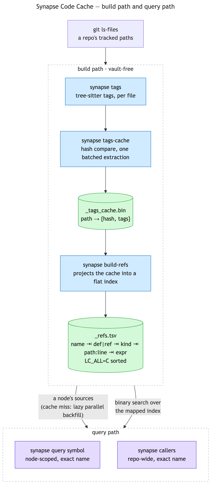
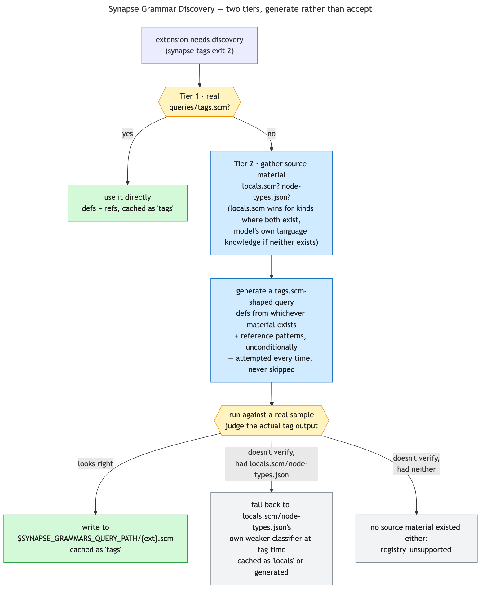

# Synapse Code Cache: the vault-free acceleration layer

A layer underneath the Graph, not a fourth component beside the Vault, the Graph and the Tools. The
work directory has always accumulated it quietly — `_tags_cache.bin`, `_refs.tsv`, plus the
vocabulary/list artifacts clustering uses — but it was previously documented only as a footnote inside
[synapse-graph.md](synapse-graph.md). Naming it here states plainly what was already true: nothing in
this chain needs Obsidian, a vault, the REST API, a cert, or an API key.

That independence is worth being precise about, because it is a fact about *dependencies* rather than
about structure. The binary on its own is enough to build and query this cache — `synapse callers`
answers with no graph, no vault and no nodes — and it is still a layer of the Graph in the sense that
matters for how the project is described: it exists to make the Graph's per-symbol questions cheap,
and the Graph is what gives its answers somewhere to live.

## Build path

`git ls-files` (so `.gitignore` exclusion is free) feeds `synapse tags`, a tree-sitter
acceleration layer: given a file, it prints real definitions and name-based call references, extracted
by parsing rather than text guessing. It fails soft — no C compiler, an unsupported
language — and every caller falls back to reading the file directly, exactly as if the script did not
exist. Which query file actually does the extracting is a two-tier decision of its own — see
[Grammar discovery](#grammar-discovery-tagsscm-localsscm-or-generated) below.

`synapse tags-cache` keeps `_tags_cache.bin` (`path → {hash, tags}`) current for a set of files,
piggybacked on the same per-file hash comparison node regeneration already performs: unchanged paths
are skipped, changed-or-missing ones are (re-)tagged in one extraction over every path that needs one.

There is no chunking and no worker pool any more, and that is a deletion rather than a regression. The
shell version split the work across `xargs -P` workers, with each worker writing a private temp file
and one sequential merge afterwards, because CLI startup and grammar load dominated the per-file cost
— chunking was how it stopped paying that per file, and it bought a real 10.26s → 1.39s on 400
files. In process there is nothing to amortise: a grammar is loaded once per extension for the life of
the run, so the whole apparatus collapses into a single pass. What that trades away is CPU
parallelism, and whether *that* costs anything on a cold repository has not been measured — it is an
open question, not a settled one.

`synapse build-refs` projects that cache into `_refs.tsv`, a flat, byte-sorted index —
`name ⇥ def|ref ⇥ kind ⇥ path:line ⇥ expression`. A separate artifact because the constraint is
*format*, not size. That was measured back when the cache was JSON: a `jq` pass over a small JSON
cache extrapolates to double-digit seconds per query once a large repo's cache reaches the
several-hundred-megabyte scale, for something meant to feel interactive — while the same data as
flat sorted lines stays sub-second at that same scale, a different regime entirely. The cache is a
binary format now rather than JSON, so the `jq` half of that comparison is history; the conclusion
it produced is why this file exists, and a sorted line index is still what a binary search wants.

## Grammar discovery: tags.scm, locals.scm, or generated

`queries/tags.scm` is not a tree-sitter standard — it's a convention GitHub's code-navigation
feature popularized, and plenty of real grammars don't ship one: of several actively maintained
grammars for one language checked directly on GitHub, none shipped a `tags.scm`, and one had
neither `tags.scm` nor `locals.scm`. Registering every such extension `unsupported`
would make whole languages contribute zero signal — no vocabulary, no ranking, no link graph — even
though the grammar itself parses the language fine. Worse, neither a grammar's `locals.scm` nor its
`node-types.json` can ever produce reference data on their own — only a real `tags.scm`-shaped query
assigns a reference role — so discovery is two tiers, not a menu of independently-sufficient
fallbacks: tier 1 wins outright if it verifies, otherwise tier 2 always generates a real query.

**Tier 1 — `queries/tags.scm`.** Unchanged: `@name` plus a sibling `@definition.<kind>`/
`@reference.<kind>` capture.

**Tier 2 — generate a tags.scm, when tier 1 is absent.** Draws on whichever of `locals.scm` and
`node-types.json` exist, with reference-pattern generation unconditional every time — the one thing
neither source file can supply by itself. `locals.scm` is nvim-treesitter's convention for
scope-aware syntax highlighting, not a tags format, so only its `@local.definition.<kind>` captures
are ground truth for kind labels, never `@local.reference`, the least standardized part of the
convention across grammars: one grammar's definitions can be genuinely well-formed and per-kind,
while another's `locals.scm` captures a bare `@reference` on *every identifier in the file* — inert
here, since only the prefixed `@local.definition.*` captures are ever read. A capture with no kind
suffix at all is a real, common nvim-treesitter shape in some grammars, not a defect — every kind
spelling, suffixed or bare, is normalized onto `Tag.kind`'s shared vocabulary through an ordered rule list
(`~/.claude/synapse-kind-synonyms.conf`), first match wins, unmapped dropped rather than guessed.

`node-types.json` fills whatever `locals.scm` doesn't cover, or stands alone when `locals.scm` is
absent, and supplies the node-type list reference patterns build from. It is a `tree-sitter generate`
build artifact every real grammar ships, so it is available almost everywhere — which makes it about
*quality*, not *presence*. A suffix/prefix heuristic (`_declaration`, `_item`, a
`class`/`struct`/`enum`/… prefix) guesses which node types are declaration-shaped; a type with a
literal `name` field becomes an ordinary tags.scm-shaped query pattern, compiled and cached the same
way tier 1's is, and one without a `name` field falls to a breadth-first walk capped at depth 3 for
the nearest `identifier`/`name` descendant. This is weaker grounding than reading `locals.scm`
directly, in two distinct ways real grammars show: a grammar can name its own declaration-shaped
nodes entirely outside the suffix convention, so the naming heuristic matches nothing at all; or it
can name things conventionally but wrap one declaration-shaped node inside another in a way no
structural heuristic over `node-types.json` alone can derive — real signal, but weaker grounding
than a grammar author's own `locals.scm` captures wherever
both exist. Same `synapse-kind-synonyms.conf` rule list as above, keyed here on the grammar's raw
node type name instead of a `locals.scm` suffix, can relabel a guessed kind or force-classify a type
the heuristic missed outright.

Every case is checked against real source before being trusted — a candidate matching zero
definitions is an automatic reject, everything past that zero-cost floor is read and judged by eye
— the same standard tier 1 already applies, extended rather than relaxed for material with less to
work with. The registry (`~/.claude/synapse-grammars.conf`) records which tier won per extension
(`"queries": "tags" | "locals" | "generated"`, absent meaning `"tags"` so every entry predating
this addition stays valid); `"locals"`/`"generated"` mean generation was attempted from that source
material and its output didn't verify well enough to write, not that the tier won without an attempt
being made — tier 2 always attempts generation once tier 1 is absent. Discovery happens once per
language, ever, not once per repository. `$SYNAPSE_GRAMMARS_QUERY_PATH/{ext}.scm`, when present,
preempts the whole cascade — a human-authored (or successfully generated) query for a grammar the
cascade doesn't handle well on its own, checked fresh every run rather than cached.

## Local-reference filtering

Orthogonal to which tier won above: a second, independent query compiled from the grammar's own
`locals.scm`, used only to build a per-file set of `@local.definition.*` names — never for
extraction itself. A tier-1 grammar with a real `tags.scm` can still have a real `locals.scm`
sitting unused beside it, and a `.ref` tag whose name is actually a local binding (a function
parameter, a `let`-binding, a functor argument) has zero real candidates for `core/links.zig`'s
cross-file join — it should never reach `_refs.tsv` as an unresolved global name in the first
place. Any `.ref` tag whose name is in that per-file set is stripped before `synapse tags` returns,
one file at a time.

Graceful degradation, not a blocking gate: no `locals.scm`, an unparseable one, or one with every
pattern disabled all fall back to today's unfiltered behavior — a grammar's `Tagger` is never
refused over this. `locals.scm` gets the same override precedent `tags.scm` already has:
`$SYNAPSE_GRAMMARS_QUERY_PATH/{ext}.locals.scm`, checked before falling back to the grammar's own
real `locals.scm`, for the case where the shipped query misses a real local-binding construct.

## Query path

Two commands read the cache, at different scopes:

- **`synapse query symbol <name> "{Node}"`** — node-scoped: exact-name definition/reference lookup
  within a node's already-known `sources`, closing the last-mile gap from "a node named the file" to a
  real `file:line`. A cache miss triggers the same lazy, parallel backfill the build path uses. Set
  `SYNAPSE_DISABLE_SYMBOL_CACHE` to turn the whole cache off.
- **`synapse callers <name>`** (a top-level subcommand, not one of `query`'s) — repo-wide:
  every call site of an exact name, anywhere, as `path:line ⇥ calling expression`, reading `_refs.tsv`
  directly. The lookup is an in-process binary search over the index, which is mapped rather than read
  — a query touches the pages its handful of lines sit on, where reading the file first meant paying
  for the full index's I/O and resident memory to reach a small fraction of it. Defaults to `ref | call`
  matches; `--all` widens to every def and ref.

  The binary search is the part worth keeping from the shell version, which reached it with `look`
  plus an exact `awk` filter: on a large repo's multi-gigabyte, multi-million-line index that
  answered in a fraction of a second, where `awk` alone — a full scan — took tens of seconds, and
  where the answer's speed depended on *which* `grep` was on `PATH`, an order-of-magnitude spread.
  In process there is one implementation, `look`'s prefix-matching quirk
  is gone (asking for `bet` no longer returns every `beta`), and the byte-order agreement that the
  writer and the reader each had a shouting comment about is arithmetic in one program rather than a
  contract between two scripts.

**`callers` needs no graph at all** — no nodes, no reverse index, no vault — and is dispatched *ahead*
of `synapse query`'s vault/namespace preamble, so that stays a structural fact rather than a merely
intended one. Filling the cache is worth doing on its own, independently of ever building a graph.

## What this buys, priced against the alternative

Precision measured on a real repo: for one common method name, 38% of raw `grep` hits were noise; for
another, 61%. That is the real saving — not smaller output, but skipping the file-opening needed to
tell a call from a definition, a comment, or an unrelated same-named method. Priced against "`grep`,
then open ~5 files to disambiguate" (the realistic baseline), a `callers` query runs 3–14× cheaper.

What it honestly does not have: no summaries, no typed relations, no staleness tracking, no "explain
this subsystem." A fast exact-name index — `grep` with the noise removed, no tree walk — narrower than
the Graph, but real, with no Obsidian install as its price of entry.

## Vault-freedom, measured

Counting vault references (`OBSIDIAN_VAULT_DIR`, the Local REST API, its cert/key) across the
subcommands of `synapse`: most are vault-free outright — `namespace`, `build-index`,
`build-lists`, `build-refs`, `callers`, `enumerate`, `gate`, `push-nodes`, `rank`, `vocab`, `tags`,
`tags-cache`, `link-graph`, and `brief`. The remaining eight (`write-node`, `frontmatter-set`,
`query`, `build-project-index`, `graph-clean`, `graph-wipe`, `index`, `doctor`) are mostly
*path*-bound rather than *API*-bound: every write is a `PUT` of a file (`frontmatter-set` a `GET`
first too, to read the one field it's changing), replaceable by writing to disk, `links` parses a
node's own `## Links` section directly rather than asking Obsidian, and `doctor`'s only vault touch
is checking whether one is configured and reachable, not reading or writing through it.

The counting is easier than it was, and that is the point of the port rather than a side effect:
this was fifteen shell scripts plus a compiled binary, so "is this piece vault-free" meant reading
each script's preamble. It is now one binary whose vault access is a single function
(`core.conf.vaultDir`) with a countable set of callers.

`build-index` moved from the second list to the first during the Zig port, which is what that
distinction predicted: the index it writes was derived, gitignored in the vault and never travelled,
so the vault reference was a `PUT` with nothing behind it. `query` moved most of the way for the same
reason — every read is a disk read now, and only `write-node`, `build-project-index`, and
`frontmatter-set` still speak to the API at all.

The genuine Obsidian dependency in the whole system is two things, not five scripts: full-text search
(the "where does X live" entry point) and `api_search_frontmatter`'s JsonLogic evaluation over the
vault. Not yet decided: whether the Code Cache ships as a separate repo, given it needs only `git` and
a C compiler to stand alone as `git ls-files → tags-cache → build-refs → callers`. That list used to
name `jq` and the `tree-sitter` CLI as well, and both are gone — libtree-sitter is linked into the
binary and the grammar's own query (`tags.scm`, `locals.scm`, or a tier-3 generated one) runs
in-process.
