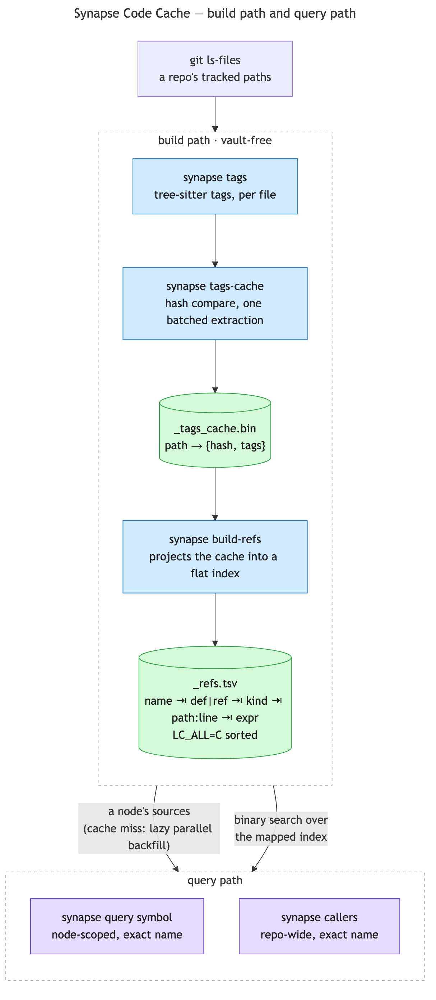
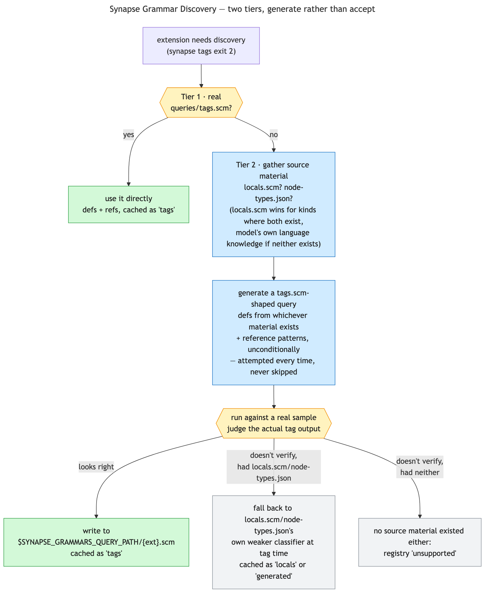

# Synapse Code Cache: the vault-free acceleration layer

A layer underneath the Graph, not a fourth component beside the Vault, the Graph and the Tools. It
lives in the work directory — `_tags_cache.bin`, `_refs.tsv`, plus the vocabulary/list artifacts
clustering uses — and nothing in this chain needs a vault or any network dependency at all.
[synapse-graph.md](synapse-graph.md) covers the Graph built on top of it.

That independence is worth being precise about, because it is a fact about *dependencies* rather than
about structure. The binary on its own is enough to build and query this cache — `synapse callers`
answers with no graph, no vault and no nodes — and it is still a layer of the Graph in the sense that
matters for how the project is described: it exists to make the Graph's per-symbol questions cheap,
and the Graph is what gives its answers somewhere to live.

For the exact byte layout of `_tags_cache.bin` and `_refs.tsv` — header and record-table fields, the
payload codec, and `Parse`'s validation order — see
[synapse-code-cache-format.md](synapse-code-cache-format.md).

## Build path

`git ls-files` (so `.gitignore` exclusion is free) feeds `synapse tags`, a tree-sitter
acceleration layer: given a file, it prints real definitions and name-based call references, extracted
by parsing rather than text guessing. It fails soft — no C compiler, an unsupported
language — and every caller falls back to reading the file directly, exactly as if `synapse tags` did not
exist. Which query file actually does the extracting is a two-tier decision of its own — see
[Grammar discovery](#grammar-discovery-tagsscm-localsscm-or-generated) below.

`synapse tags-cache` keeps `_tags_cache.bin` (`path → {hash, tags}`) current for a set of files,
piggybacked on the same per-file hash comparison node regeneration already performs: unchanged paths
are skipped, changed-or-missing ones are (re-)tagged. The paths that need tagging are cut into slices
(at least 500 paths each, or enough to give each processor one), each slice is tagged by
its own task with an extractor of its own — a grammar is loaded once per extension per extractor — and
the slices are put back in path order before a single commit, so the cache does not depend on how many
tasks there were. A set small enough for one slice is tagged on the calling task.

`synapse build-refs` projects that cache into `_refs.tsv`, a flat, byte-sorted index —
`name ⇥ def|ref ⇥ kind ⇥ path:line ⇥ expression`. A separate artifact because the constraint is
*format*, not size: a query over several hundred megabytes of structured cache that parsed each record
would cost seconds for something meant to feel interactive, while the same data as flat sorted lines
is answered by a binary search that reads a few blocks. The sorted line index is what that search
wants.

## Grammar discovery: tags.scm, locals.scm, or generated

`queries/tags.scm` is not a tree-sitter standard — it's a convention GitHub's code-navigation
feature popularized, and plenty of real grammars don't ship one: of several actively maintained
grammars for one language checked directly on GitHub, none shipped a `tags.scm`, and one had
neither `tags.scm` nor `locals.scm`. Registering every such extension `unsupported`
would make whole languages contribute zero signal — no vocabulary, no ranking, no link graph — even
though the grammar itself parses the language fine. Worse, neither a grammar's `locals.scm` nor its
`node-types.json` can ever produce reference data on their own — only a real `tags.scm`-shaped query
assigns a reference role — so discovery is two tiers, not a menu of independently-sufficient
fallbacks: tier 1 wins outright if it verifies, otherwise tier 2 always generates a real query.

**Tier 1 — `queries/tags.scm`.** Unchanged: `@name` plus a sibling `@definition.<kind>`/
`@reference.<kind>` capture.

**Tier 2 — generate a tags.scm, when tier 1 is absent.** Draws on whichever of `locals.scm` and
`node-types.json` exist, with reference-pattern generation unconditional every time — the one thing
neither source file can supply by itself. `locals.scm` is nvim-treesitter's convention for
scope-aware syntax highlighting, not a tags format, so only its `@local.definition.<kind>` captures
are ground truth for kind labels, never `@local.reference`, the least standardized part of the
convention across grammars: one grammar's definitions can be genuinely well-formed and per-kind,
while another's `locals.scm` captures a bare `@reference` on *every identifier in the file* — inert
here, since only the prefixed `@local.definition.*` captures are ever read. A capture with no kind
suffix at all is a real, common nvim-treesitter shape in some grammars, not a defect — every kind
spelling, suffixed or bare, is normalized onto `Tag.kind`'s shared vocabulary through an ordered rule list
(`~/.claude/synapse-kind-synonyms.conf`), first match wins, unmapped dropped rather than guessed.

`node-types.json` fills whatever `locals.scm` doesn't cover, or stands alone when `locals.scm` is
absent, and supplies the node-type list reference patterns build from. It is a `tree-sitter generate`
build artifact every real grammar ships, so it is available almost everywhere — which makes it about
*quality*, not *presence*. A suffix/prefix heuristic (`_declaration`, `_item`, a
`class`/`struct`/`enum`/… prefix) guesses which node types are declaration-shaped; a type with a
literal `name` field becomes an ordinary tags.scm-shaped query pattern, compiled and cached the same
way tier 1's is, and one without a `name` field falls to a breadth-first walk capped at depth 3 for
the nearest `identifier`/`name` descendant. This is weaker grounding than reading `locals.scm`
directly, in two distinct ways real grammars show: a grammar can name its own declaration-shaped
nodes entirely outside the suffix convention, so the naming heuristic matches nothing at all; or it
can name things conventionally but wrap one declaration-shaped node inside another in a way no
structural heuristic over `node-types.json` alone can derive — real signal, but weaker grounding
than a grammar author's own `locals.scm` captures wherever
both exist. Same `synapse-kind-synonyms.conf` rule list as above, keyed here on the grammar's raw
node type name instead of a `locals.scm` suffix, can relabel a guessed kind or force-classify a type
the heuristic missed outright.

Every case is checked against real source before being trusted — a candidate matching zero
definitions is an automatic reject, everything past that zero-cost floor is read and judged by eye
— the same standard tier 1 already applies, extended rather than relaxed for material with less to
work with. The registry (`synapse-grammars.conf`, resolved through the same `$XDG_CONFIG_HOME`/`~/.config/synapse/` tiering every other conf file gets, falling back to `~/.claude/synapse-grammars.conf` last) records which tier won per extension
(`"queries": "tags" | "locals" | "generated"`, absent meaning `"tags"` so every entry predating
this addition stays valid); `"locals"`/`"generated"` mean generation was attempted from that source
material and its output didn't verify well enough to write, not that the tier won without an attempt
being made — tier 2 always attempts generation once tier 1 is absent. Discovery happens once per
language, ever, not once per repository. `$SYNAPSE_GRAMMARS_QUERY_PATH/{ext}.scm`, when present,
preempts the whole cascade — a human-authored (or successfully generated) query for a grammar the
cascade doesn't handle well on its own, checked fresh every run rather than cached.

What the binary itself does with a `"locals"` or `"generated"` registry entry is definitions only:
`@local.definition.*` captures normalized through the kind-synonym rules, or the `node-types.json`
classifier's patterns plus its bounded walk, respectively. Reference data comes from a `tags.scm`
shape — the repository's own, or the one orientation generates and writes to the override path.

## Local-reference filtering

Orthogonal to which tier won above: a second, independent query compiled from the grammar's own
`locals.scm`, used only to build a per-file set of `@local.definition.*` names — never for
extraction itself. A tier-1 grammar with a real `tags.scm` can still have a real `locals.scm`
sitting unused beside it, and a `.ref` tag whose name is actually a local binding (a function
parameter, a `let`-binding, a functor argument) has zero real candidates for `Core.Links`'
cross-file join — it should never reach `_refs.tsv` as an unresolved global name in the first
place. Any `.ref` tag whose name is in that per-file set is stripped before `synapse tags` returns,
one file at a time.

Graceful degradation, not a blocking gate: no `locals.scm`, an unparseable one, or one with every
pattern disabled all fall back to today's unfiltered behavior — a grammar's `Tagger` is never
refused over this. `locals.scm` gets the same override precedent `tags.scm` already has:
`$SYNAPSE_GRAMMARS_QUERY_PATH/{ext}.locals.scm`, checked before falling back to the grammar's own
real `locals.scm`, for the case where the shipped query misses a real local-binding construct.

## Query path

Two commands read the cache, at different scopes:

- **`synapse query symbol <name> "{Node}"`** — node-scoped: exact-name definition/reference lookup
  within a node's already-known `sources`, closing the last-mile gap from "a node named the file" to a
  real `file:line`. A cache miss triggers the same lazy, parallel backfill the build path uses. Set
  `SYNAPSE_DISABLE_SYMBOL_CACHE` to turn the whole cache off.
- **`synapse callers <name>`** (a top-level subcommand, not one of `query`'s) — repo-wide:
  every call site of an exact name, anywhere, as `path:line ⇥ calling expression`, reading `_refs.tsv`
  directly. The lookup is an in-process binary search over the index, read a 4 KB block at a time
  — a query touches the blocks its handful of lines sit on, where reading the file first meant paying
  for the full index's I/O and resident memory to reach a small fraction of it. Defaults to `ref | call`
  matches; `--all` widens to every def and ref.

  The lookup is a binary search over raw bytes, so on a large repo's multi-gigabyte, multi-million-line
  index it answers in a fraction of a second where a full scan would take tens of seconds. Names match
  exactly, not by prefix: asking for `bet` does not return every `beta`. The byte order the writer
  sorts in and the reader bisects on is the same bytewise order in one program, not a contract between
  two tools.

**`callers` needs no graph at all** — no nodes, no reverse index, no vault — and is dispatched *ahead*
of `synapse query`'s vault/namespace preamble, so that stays a structural fact rather than a merely
intended one. Filling the cache is worth doing on its own, independently of ever building a graph.

## What this buys, priced against the alternative

Precision measured on a real repo: for one common method name, 38% of raw `grep` hits were noise; for
another, 61%. That is the real saving — not smaller output, but skipping the file-opening needed to
tell a call from a definition, a comment, or an unrelated same-named method. Priced against "`grep`,
then open ~5 files to disambiguate" (the realistic baseline), a `callers` query runs 3–14× cheaper.

What it honestly does not have: no summaries, no typed relations, no staleness tracking, no "explain
this subsystem." A fast exact-name index — `grep` with the noise removed, no tree walk — narrower than
the Graph, but real, with nothing but this binary as its price of entry.

## Vault-freedom, measured

Counting vault references (`SYNAPSE_VAULT_DIR`, `Ports.Store`, `Ports.Link_Graph`, or a
vault-resident path resolved from either) across all 44 of `synapse`'s subcommands: the
code-graph/cache side is vault-free outright — `namespace`, `build-index`, `build-lists`,
`build-refs`, `build-deps`, `build-namespaces`, `callers`, `enumerate`, `gate`, `push-nodes`,
`rank`, `vocab`, `tags`, `tags-cache`, `link-graph`, `brief`, `index` (its own `_index.bin` lives
in the work dir, never the vault), `comments-check`, `comments-sweep`, and `now` -- 20 in total.
Eight more are *path*-bound, not *network*-bound at all: `write-node`, `frontmatter`, `query`,
`build-project-index`, `graph-clean`, `graph-wipe`, `context`, and `doctor` -- every write among these is
plain disk I/O (`frontmatter` a plain disk read first too, for the one field it's changing) under
either `Store` backend, `query`/`links` read a node's file or its `## Links` section directly off
a resolved path, and `doctor` has no live-reachability check at all -- every check it runs is a
local file or config read. The remaining 16 are the `vault-*` family itself (`vault-read` through
`vault-delete`) -- obviously and entirely vault-bound, since
being the vault's own read/write/search/link-graph surface is their whole reason to exist.

The counting is easy because the tooling is one binary whose vault access is a single function
(`Conf_Files.Vault_Dir`) with a countable set of callers.

`build-index` is on the first list, which is what that
distinction predicts: the index it writes is derived, gitignored in the vault and never travels.
`query` is path-bound for the same reason — every read is a disk read. `write-node`, `build-project-index`, and `frontmatter` write
through plain disk I/O too, and so do `vault-search-text` and the `LinkGraph`/`Renamer`
subcommands: `Disk_Store` has real `Search`/`Link_Graph`/`Renamer` of its own (rarity-weighted
ranking, wikilink resolution, rename-with-referrer-rewrite), not stubs, and it is the only backend
these ever reach -- `git`, the one optional integration, layers a commit lifecycle over `write`/
`renamer` without touching how any of this resolves. `vault-search`'s structured JsonLogic filtering
(`Core.Vault_Query`) is built the same way: `Store.List` +
`Store.Read` per candidate + pure JsonLogic evaluation, one code path under every backend. Not yet decided: whether the Code Cache ships as a separate repo, given it needs only `git` and
a C compiler to stand alone as `git ls-files → tags-cache → build-refs → callers`. libtree-sitter is
linked into the binary and the grammar's own query (`tags.scm`, `locals.scm`, or a tier-3 generated
one) runs in-process.
