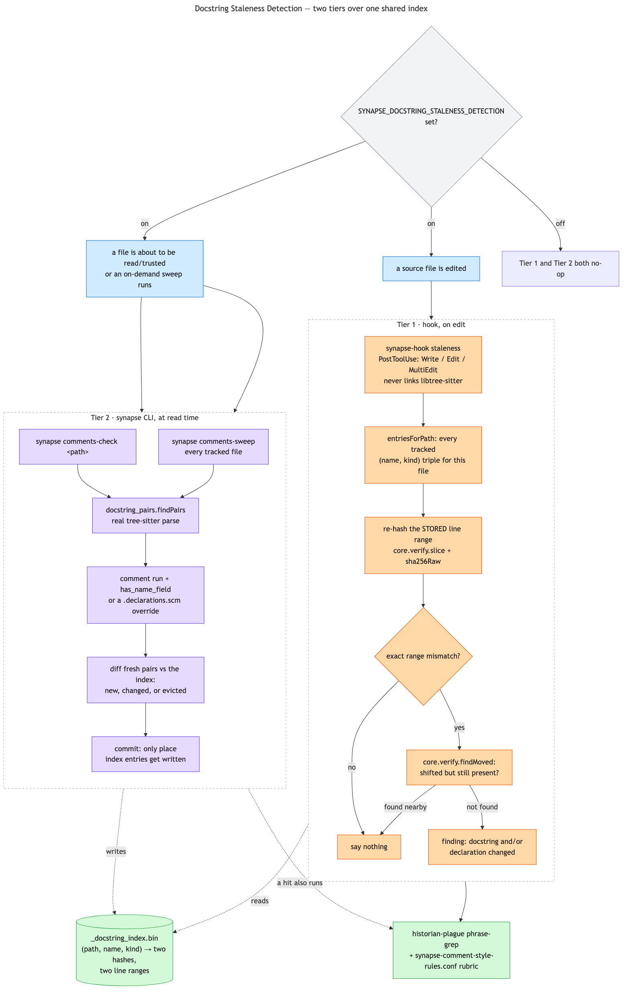

# Docstring Staleness Detection

An opt-in check that a docstring and the declaration it documents still agree, using the same
two-tier staleness model already described in [synapse-graph.md](synapse-graph.md#two-tier-staleness)
for code-graph nodes — a cheap, automatic edit-time check, plus an authoritative read-time check that
does the real work. It catches two separate failure modes: **historian-plague phrasing** (a docstring
narrates how code changed — "no longer does X", "used to be Y" — instead of describing what's true
now) and **staleness** (a docstring's claim quietly went wrong as the code moved on).

Off by default. Enabled with `SYNAPSE_DOCSTRING_STALENESS_DETECTION` in `synapse.conf` (or the
identically-named environment variable, which overrides it — the standard `core.conf.resolve`
precedence every `synapse.conf`-backed setting already follows). Any non-empty value turns it on;
there is no boolean parsing.

## Scope

A docstring is the comment block attached directly to a declaration — function, type, struct,
whatever the grammar calls a declaration — with no blank line between them. Inline comments inside a
function body, and markdown docs describing another file's behavior, are both out of scope: neither
has the direct structural adjacency this design grounds staleness against.

## Finding the pair: comments, declarations, and two override slots

Comments are tree-sitter `extras` — present and walkable in the parse tree without needing a grammar
rule for their position. The near-universal convention names that node type literally `comment`,
which is the default; the rare grammar that names it something else gets a verified per-grammar
override, `$SYNAPSE_GRAMMARS_QUERY_PATH/{ext}.comments.scm`, holding a single node-type pattern
(`(type_name)` or `(type_name) @capture`) rather than a real compiled query.

Pairing itself is structural, not semantic, and deliberately independent of the `tags.scm`/
`locals.scm`/generated tagger cascade (see
[Grammar discovery](synapse-code-cache.md#grammar-discovery-tagsscm-localsscm-or-generated)) — this
feature is separately toggleable, so its core detection must not share fate with tag extraction's own
success or failure for a grammar. The only thing genuinely shared is grammar loading itself
(`treesitter.grammar.resolveAndLoad`) and the override-file resolution pattern.

Starting from a comment node, the walk collects a contiguous run of directly-adjacent (row-consecutive)
sibling comments — a real doc comment, written as continuous lines with no gap. The run ends either at
a blank line (a floating comment documenting nothing) or at the next directly-adjacent sibling. That
sibling only counts as the declaration if it looks like one: does it expose a tree-sitter `name`
field, checked live via `ts_node_child_by_field_name`. This is the same language-agnostic signal
`node_types.zig`'s own generated-declaration classification already relies on (there against the
static `node-types.json` schema, here per-instance against the live parse) — it's what tells an
ordinary statement (a bare `return;` inside a function body, say) apart from a real declaration a
comment might legitimately document.

Some grammars expose no `name` field on a node that genuinely is a declaration — Zig's
`variable_declaration` (the node behind `pub const Foo = struct {...}`) is the concrete case: the
identifier there is an unlabeled positional child. That gets a second override,
`{ext}.declarations.scm`, listing additional node-type names to treat as declarations even without a
name field, checked alongside the name-field test (either one qualifies).

The declaration's own raw tree-sitter node type name becomes the index key's `kind` — never
normalized through `kind_synonyms.zig`'s vocabulary, since nothing here needs to agree with tags.scm's
own classification. The key's `name` is the declaration's own first line of text (its signature/header
line), not a semantically-extracted identifier: fully grammar-agnostic, human-inspectable, and a real
signature change is exactly the kind of edit that should count as "look at this again."

## The index

Lives in `$SYNAPSE_WORK_DIR/_docstring_index.bin`, alongside `_tags_cache.bin`/`_index.bin`. One
record per `(path, declaration name, declaration kind)` triple — not per file, since a file can hold
many docstrings — holding two raw 32-byte SHA-256 hashes (`core.verify.sha256Raw`, the sub-range hash
`grounded_in` staleness already uses, not the tags cache's whole-file git-blob hash) and two 1-based
inclusive line ranges, one for the docstring and one for the declaration, as of the last time the pair
was derived.

A mismatch on **either** hash is the trigger: code changed under an unchanged docstring, or the
docstring changed over unchanged code, both mean "this pair needs a look." A brand-new triple is a
mismatch against an absent baseline, so it's verified the first time it's written.

### On-disk format

Modeled on `_tags_cache.bin`'s shape (fixed-width sorted record table, variable-length strings held
out of line) but simpler: there is no separate payload region, since a record's only data — two
32-byte hashes plus four line numbers — fits directly in the fixed-width row.

**Header, 32 bytes:**

| Field | Type | Notes |
| --- | --- | --- |
| `magic` | 8 bytes | `SYNDOCS\0`. |
| `version` | u32 | Currently `1`. |
| `entry_count` | u32 | Number of records. |
| `strings_off` | u64 | Byte offset of the string region. |
| `crc32` | u32 | CRC-32 over the whole post-header region — unlike the tags cache, there's no payload region to exclude, so a truncation past the record table is always `ChecksumMismatch`, never a separate `Truncated`. |
| `reserved` | u32 | Written zero, keeps the record table 8-byte aligned. |

**Record, 109 bytes:**

| Field | Type | Notes |
| --- | --- | --- |
| `path_off`/`path_len` | u64 / u16 | Into the string region. |
| `name_off`/`name_len` | u64 / u16 | The declaration's first line of text. |
| `kind_off`/`kind_len` | u64 / u8 | The declaration's raw tree-sitter node type. |
| `docstring_hash` | 32 bytes | Raw SHA-256 of the docstring's own text. |
| `decl_hash` | 32 bytes | Raw SHA-256 of the declaration's body. |
| `docstring_start_line`/`docstring_end_line` | u32 / u32 | 1-based inclusive, as of the last derive. |
| `decl_start_line`/`decl_end_line` | u32 / u32 | Same. |

The table is sorted by `(path, name, kind)` bytes, which makes both an exact-triple lookup and "every
entry for one file" (a contiguous range) binary-searchable. Every multi-byte field is written and read
one at a time with an explicit `.little`, no `@bitCast`/`packed struct`. A header that fails to parse
is discarded and rebuilt from scratch — nothing here can't be recomputed from source.

`core/docstring_index.zig`'s `Cache` wraps the format the same way `tags_cache.zig` wraps its own:
`open` (mmap, absent/corrupt/wrong-version all degrade to an empty usable cache except a real
`MapFailed`), `get`, `entriesForPath` (every tracked triple for one file, in on-disk order — what both
tiers scan), `needsCheck` (which requested triples aren't already held at exactly that hash pair), and
`commit` (merge updates and removals, write to a temp file, rename over the original — a concurrent
reader never sees a half-written index; single-writer, undefended, same tolerance for a lost race as
the tags cache).

## Tier 1: the edit-time hook

`synapse-hook staleness`'s existing `PostToolUse` handler (`Write`/`Edit`/`MultiEdit`) gets one more
check, computed independently of whether the edited file has any code-graph node coverage at all —
a real bug (an early return silently discarding a computed docstring finding) was caught and fixed
during implementation, precisely because coupling this to node coverage would have been the exact kind
of accidental dependency this feature's whole design avoids.

`synapse-hook` deliberately never links libtree-sitter — it runs on every edit with a person waiting,
so it structurally cannot re-derive a pair via a real parse. Instead, for every tracked triple already
recorded against the just-edited file, it re-hashes the *stored* line range with pure bytes:
`core.verify.slice` plus `sha256Raw`, exactly the trick `checkCitedEvidence`'s existing `grounded_in`
check already uses. If the exact range no longer matches, it falls back to `core.verify.findMoved`
(same trick, same reason) before concluding the content genuinely changed rather than merely shifted.

A hit on either the docstring's or the declaration's range surfaces as a finding in the hook's existing
`additionalContext` channel, merged alongside the citation/blast-radius findings it already reports.
When the docstring range is still locatable, the finding also runs the historian-plague phrase-grep
(below) and appends the style rubric if anything hit.

## Tier 2: the read-time check

Tier 2 is the only thing that ever calls `docstring_pairs.findPairs` — a real parse — and therefore the
only place index entries, ranges included, get written: discovering a new docstring, catching a
rename, or refreshing a shifted range are all real parses, which only the treesitter-linked `synapse`
CLI can do.

**`synapse comments-check <path>`** checks one file: resolves its grammar, finds every
docstring/declaration pair, diffs them against the index (new, changed, or evicted because a
declaration's name+kind no longer appears — the same "trigger, not a verdict" tradeoff a genuine
rename accepts), commits the fresh state, and reports what changed. Silent when nothing did.

**`synapse comments-sweep [--reenumerate]`** is the on-demand, whole-repo counterpart — the third
sibling to `/synapse-rebuild-diff` (code-graph drift) and `/synapse-vault-tidy` (vault-note health),
for revisiting docstrings nothing else has touched. It reuses the same `all.txt` tracked-file listing
`enumerate`/`build-lists` already maintain, and calls the identical per-file check `comments-check`
uses (`docstring_check.checkFile`, shared between both commands) once per path, so a sweep and a
single-file check can never disagree on what "checking a file" means. Reports each changed file under
a `-- {path} --` header, then a `files checked`/`changed`/`evicted` totals line.

Neither command needs a docstring to be attached to anything Tier 1 already tracked: a docstring
nobody's editing nearby just sits unfixed until something reads it, the same tradeoff `stale: true`
code-graph nodes already accept — if nothing's reading it, nothing currently depends on it being
right.

## Style: the same pass, not a second mechanism

Whenever a docstring is actually inspected — by either tier — the check is really two filters in one
pass. `core.comment_style_rules.historianPlaguePhrase` is a cheap, deliberately non-word-boundary-aware
substring scan for the classic tells ("no longer", "used to", "any more") — free, but it only catches
phrasing that hits an exact keyword.

The second half needs judgment a grep can't supply: whenever a finding fires, the caller also emits a
plain-text rubric — `synapse-comment-style-rules.conf`, resolved via the same tiered lookup every other
`synapse-*.conf` file uses. It **ships empty**, the same "ship empty, earn every rule" shape the
namespace/dependency/kind-synonym/grammar conf files already have: no rule here presumes one team's
stylistic taste is universal. When a human flags a style problem the inference check missed, the fix is
to correct the instance *and* append the rule that would have caught it — the same self-populating
mechanism `synapse-tag-vocabulary.conf`/`synapse-projects.conf` already use.

## Sources

- `src/core/docstring_index/format.zig` — the `_docstring_index.bin` header, record table, encode/parse/View.
- `src/core/docstring_index.zig` — the `Cache` wrapper (`enabled`, open, get, entriesForPath, needsCheck, commit) and the opt-in gate.
- `src/core/comment_style_rules.zig` — the historian-plague phrase-grep and the rubric-conf reader.
- `src/adapters/treesitter/docstring_pairs.zig` — comment/declaration pairing: `resolveLanguage`, `resolveCommentTypeName`, `resolveDeclarationOverrides`, `findPairs`.
- `src/adapters/treesitter/grammar.zig` — `resolveAndLoad`, the shared grammar-load primitive this feature and the tagger cascade both call.
- `src/apps/hook/staleness.zig` — Tier 1's `checkDocstrings`/`rangeChanged`.
- `src/apps/synapse/docstring_check.zig` — Tier 2's shared `checkFile`, called by both commands below.
- `src/apps/synapse/comments_check_cmd.zig` — `synapse comments-check <path>`.
- `src/apps/synapse/comments_sweep_cmd.zig` — `synapse comments-sweep [--reenumerate]`.
