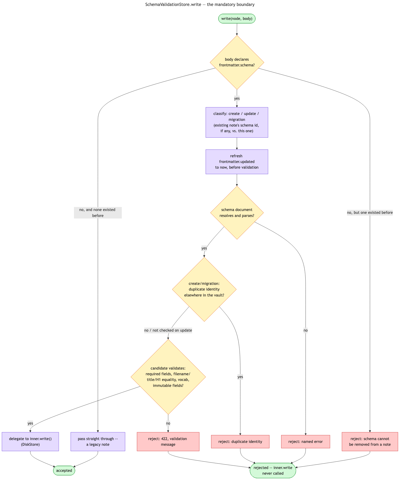
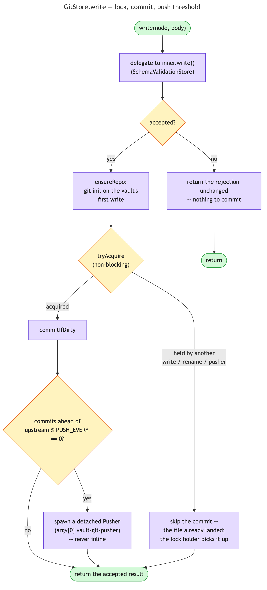

# Synapse Extended Store

`DiskStore` is the default `Store` backend: it reads and writes the vault folder directly, with no
external dependency at all. Search, the link graph
(backlinks/links/unresolved/orphans/deadends/ambiguous), and rename all have real implementations of
their own — rarity-weighted ranked full-text search, case-insensitive wikilink resolution, and
rename-with-referrer-rewrite — not stubs. It is enough on its own for every `synapse` CLI subcommand
and every skill/command that reaches the vault through `Store`.

An **extended store** is an optional decorator over the mandatory
`SchemaValidationStore -> DiskStore` persistence boundary: `read`/`write`/`list`/`search`/the link
graph stay plain delegations to whatever it wraps, and the decorator adds its own behavior only
around the operations it actually cares about. `GitStore`, the one shipped today, delegates
everything except `write` and `renamer` straight through, and wraps those two in a commit under a
shared lock (pushing once enough commits pile up). Nothing built on
`ports.Store`/`ports.LinkGraph`/`ports.Renamer` needs to know which one is actually configured.

Schema validation is not named in `SYNAPSE_VAULT_INTEGRATIONS` and cannot be disabled there. For
example, `git` resolves as `GitStore -> SchemaValidationStore -> DiskStore`, ensuring a rejected
write has no outer integration side effect.

Enable one by adding its name to `SYNAPSE_VAULT_INTEGRATIONS` (a comma-separated, outer-to-inner
list) in `synapse.conf`; unset keeps everything local. `disk` is never named in the value — it's
always the implicit innermost element. See [synapse-vault.md](synapse-vault.md#version-control-synapse_vault_integrationsgit)
for `git`'s own setup.

## SchemaValidationStore

The mandatory boundary — not something `SYNAPSE_VAULT_INTEGRATIONS` names, layers, or can disable.
Every resolved chain places it immediately outside `DiskStore`, so any configured integration wraps
it rather than the other way around: a rejected write never reaches disk, and never reaches an
outer integration's own side effects either (`GitStore` has nothing to commit if the write it
delegated to never landed). `read`/`list`/`search` are pure pass-throughs; only `write` does
anything.

A note with no `schema:` frontmatter field passes straight through unchanged — a legacy note.
Once a note declares one, every write to it goes through:

1. **Classify the write** as `create` (no existing note at this path), `migration` (the schema id
   changed from what's on disk), or `update` (unchanged) — the mode gates which checks run below.
   An `update` never lists or scans the vault at all; only `create`/`migration` do.
2. **Refresh `updated`** to the current local timestamp, at this boundary, before validation runs —
   so no caller above it has to pre-read a note just to own that timestamp.
3. **Resolve and parse the schema** (`${SYNAPSE_CONTENT_ROOT}/schema/{schema_id}.yaml`) — a resolve
   or parse failure rejects the write with the error named.
4. **Check for a duplicate identity value** elsewhere in the vault, `create`/`migration` only — the
   schema's own `unique` declaration names which frontmatter field has to be one-of-a-kind.
5. **Validate the candidate** against the schema: required frontmatter, filename/title/H1 equality,
   the note kind's Markdown outline, configured project/tag vocabularies, and immutable
   creation/identity fields.

Any failure returns a 422-shaped `WriteResult` (`accepted: false`, `status: 422`, the validation
message as `body`) — the candidate never reaches `inner.write()`. Only a fully validated write
proceeds to whatever the resolved chain's inner store actually is.

## GitStore

The one shipped integration. Wraps a lower `Store` — `SchemaValidationStore`, in the only chain
that exists today — and owns the vault's own git lifecycle. `read`/`list`/`search`/the link graph
are pure delegations to whatever it wraps; only `write` and `renamer` do anything git-specific.

**`write`** delegates to `inner.write()` first. A rejection (from `SchemaValidationStore`, in
practice) comes back untouched — there is nothing to commit. On acceptance:

1. `ensureRepo` initializes a repo on the vault's first write — a vault with no `.git` yet gets one,
   and a vault with no remote configured just gets local-only versioned history.
2. `tryAcquire` takes a shared lock, non-blocking. If another write, rename, or the detached Pusher
   already holds it, this call skips its own commit outright: the file already landed on disk, and
   whichever operation does hold the lock (or the next write to acquire it) picks up the change in
   its own `commitIfDirty` — nothing is lost, just not committed by this call specifically.
3. Holding the lock, `commitIfDirty` commits whatever changed. If enough local commits have then
   piled up ahead of upstream (`SYNAPSE_VAULT_PUSH_EVERY`, default 5, counted in commits), a
   detached Pusher process is spawned (`argv[0] vault-git-pusher {vault}`) — never inline, since a
   network push has no business sitting on a write's critical path.

**`renamer` (`GitRenamer`)** delegates the actual move to whatever the resolved chain's own renamer
is (`DiskRenamer`, since `git` is the only integration composed over it today), then commits under
the same lock-or-skip discipline as `write` — no separate push-threshold check here, since a rename
landing between two writes still gets swept up by whichever side's own commit count crosses the
threshold first.

**The detached Pusher (`runPusher`)** acquires the lock with a short bounded retry, pulls
(`--rebase --autostash`, aborting on conflict), commits anything a concurrent write had to skip
while the Pusher held the lock, then pushes — pull and catch-up commit happen before the push, so a
just-skipped change rides the same push cycle instead of waiting for a later one to notice it.

## Future extended stores

Notion, or anything else worth layering its own behavior over `DiskStore`'s, would document its
setup in its own section here, following the same contract: only the operations it actually changes
are overridden, everything else passes straight through, enabled by adding its name to
`SYNAPSE_VAULT_INTEGRATIONS`. It would be another decorator over the one real store, the same shape
`git` already is, not a new kind of peer backend.
