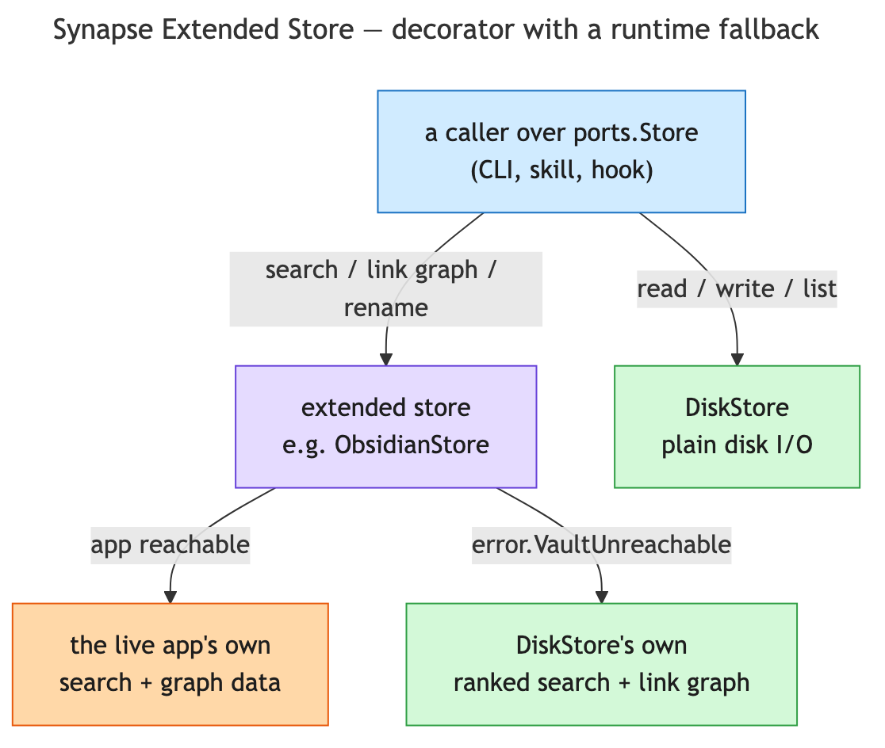

# Synapse Extended Store

`DiskStore` is the default `Store` backend: it reads and writes the vault folder directly, with no
external dependency at all. Search, the link graph
(backlinks/links/unresolved/orphans/deadends/ambiguous), and rename all have real implementations of
their own — rarity-weighted ranked full-text search, case-insensitive wikilink resolution, and
rename-with-referrer-rewrite — not stubs. It is enough on its own for every `synapse` CLI subcommand
and every skill/command that reaches the vault through `Store`.

An **extended store** is an optional decorator over `DiskStore`: `read`/`write`/`list` stay identical
plain disk I/O, but `search`, the link graph, and rename are handed off to a running external app's
own live capabilities when reachable, falling back to `DiskStore`'s implementation automatically the
moment that app isn't (`error.VaultUnreachable`). Nothing built on `ports.Store`/`ports.LinkGraph`/
`ports.Renamer` needs to know which one is actually configured.



Enable one by adding its name to `SYNAPSE_VAULT_INTEGRATIONS` (a comma-separated, outer-to-inner
list) in `synapse.conf`; unset keeps everything local. `disk` is never named in the value — it's
always the implicit innermost element.

## Obsidian

The only extended store shipped today. Reaches a running Obsidian app through its official CLI
(ships with the app, off by default).

### Setup

1. Install Obsidian, open (or create) your vault. No community plugin needed — Synapse reaches
   Obsidian through its official CLI: **Settings → General → Advanced → Command line interface**,
   toggle it on. Obsidian needs to be running for Synapse to reach it — if it isn't, Synapse falls
   back to `disk`'s own implementation automatically rather than failing.
2. (Optional) **Settings → Community plugins → Browse**, install + enable:
   - **Headless Mode** — lets Obsidian run as a background daemon with no visible window; enable
     "Start headless" in its settings.
   - **Iconic** — folder/file icons.
3. Set `SYNAPSE_VAULT_INTEGRATIONS="obsidian"` in `synapse.conf` — or `"git,obsidian"` to also
   have the vault own its own git lifecycle (see [synapse-vault.md](synapse-vault.md)).
4. (Recommended) Set Obsidian to start automatically at login, so it is always running:
   - **macOS**:
     ```sh
     osascript -e 'tell application "System Events" to make login item at end with properties {path:"/Applications/Obsidian.app", hidden:false}'
     ```
     or **System Settings → General → Login Items → +**.
   - **Linux**: drop an XDG autostart entry (works across GNOME/KDE/XFCE):
     ```sh
     mkdir -p ~/.config/autostart
     cat > ~/.config/autostart/obsidian.desktop <<'EOF'
     [Desktop Entry]
     Type=Application
     Name=Obsidian
     Exec=obsidian
     X-GNOME-Autostart-enabled=true
     EOF
     ```
     Adjust `Exec=` to match your install (e.g. the AppImage path, or `flatpak run md.obsidian.Obsidian`
     for a Flatpak install).
   - **Windows**: press **Win+R**, type `shell:startup`, hit Enter, then drop a shortcut to
     `Obsidian.exe` into the folder that opens.

`synapse doctor` reports the CLI's own reachability only under this backend — the check reports "not
needed" under `disk`, never a false failure.

## Future extended stores

Notion, or anything else with its own live search/graph/rename worth preferring over `DiskStore`'s,
would document its setup in its own section here, following the same contract: `read`/`write`/`list`
unchanged, `search`/link-graph/rename opportunistic with an automatic fallback to whatever it wraps,
enabled by adding its name to `SYNAPSE_VAULT_INTEGRATIONS`. It would be another decorator over the
one real store, the same shape `git`/`obsidian` already are, not a new kind of peer backend — see
[synapse-vault.md](synapse-vault.md) for `git`'s own version-control integration.
