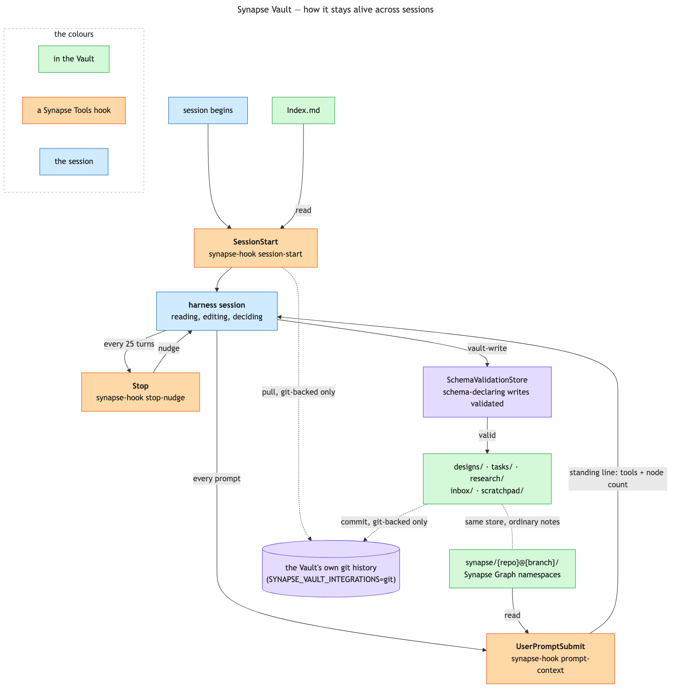

# Synapse Vault

A permanent, curated knowledge base that persists across every project and
every session, separate from (and complementary to) Claude Code's own `~/.claude` auto-memory
system. Auto-memory is for *how to work with this user*; the Vault is for durable, browsable notes
about the work itself.

It is also the host for [Synapse Graph](synapse-graph.md), which stores its per-repo code graphs here as
ordinary notes under `synapse/{repo}@{branch}/` rather than in a folder of their own. One store, one
search, one sync concern.



The boxes name the vault-relevant hooks; what each one does is here rather than crammed inside the box.

| Hook | Fires | What it does |
|---|---|---|
| `synapse-hook session-start` | `SessionStart` | Injects `Index.md`, this repo's Graph pointer if a namespace covers the current branch, and a catalogue of the other namespaces in the vault. A plain path lookup — never a model call, so a repo that never opted in pays nothing. Also spawns a detached vault pull, a no-op unless the resolved backend is `git`. |
| `synapse-hook prompt-context` | `UserPromptSubmit` | One fixed standing line per turn, instructing that the Graph/Code Cache be queried before any grep in a repo with a namespace -- no search, no node list, no network, and no off switch. |
| `synapse-hook stop-nudge` | `Stop`, every 25 turns | Forces a real "did anything here belong in the vault?" check-in rather than relying on the agent to remember unprompted. |

## The vault

Plain markdown files with YAML frontmatter, persisted by `DiskStore` — the one real backend behind
`ports.Store` (`SYNAPSE_VAULT_INTEGRATIONS` unset), no external dependency of any kind. Every
resolved Vault Store places the mandatory `SchemaValidationStore` immediately outside DiskStore;
configured integrations wrap that boundary, so an invalid schema-declaring write cannot reach disk,
Git, or Obsidian. Its `search` does real rarity-weighted ranking (word document-frequency measured against the
vault, weighted by the same `distinctivenessScore` formula `/synapse-init` uses for cluster judging),
its link graph (`vault-backlinks`/`vault-links`/`vault-unresolved`/`vault-orphans`/`vault-deadends`/
`vault-ambiguous`) resolves wikilinks case-insensitively and logs an ambiguous match rather than
guessing, and its rename (`vault-rename`) rewrites every referring wikilink. One or more optional
**integrations** can each layer extra behavior on top -- `obsidian` hands `search`/link-graph/rename
off to a running external app's own live capabilities, falling back to `DiskStore`'s implementation
automatically whenever that app isn't reachable (see
[synapse-extended-store.md](synapse-extended-store.md)); `git` owns the vault's own git lifecycle
(below). Both can be configured together (`SYNAPSE_VAULT_INTEGRATIONS="git,obsidian"`).

Hooks and the `synapse` CLI's `vault-*` subcommands (the door skills and commands use to reach the
vault, instead of naming a tool directly) both go through `Store`/`LinkGraph`/`Renamer`, so none of
them cares which backend is actually configured.

`synapse.conf` (resolved through the tiered lookup in
[synapse-config.md](synapse-config.md#where-a-conf-file-actually-lives)) holds the one piece of
genuinely machine-local state: `SYNAPSE_VAULT_DIR`.

### Version control (`SYNAPSE_VAULT_INTEGRATIONS=git`)

`git` is an integration like `obsidian` -- it composes whatever's beneath it in the configured chain
(the disk store alone under plain `git`, or `ObsidianStore` under `git,obsidian`) and additionally
owns the vault's own git lifecycle. Choosing it is the opt-in — a vault with no `.git` yet gets one
initialized on its first write, and a vault with no remote configured just gets local-only versioned
history.

Every write commits under a lock shared with the push/pull steps below, so a commit and a rebase
never interleave; a write that loses that lock to a concurrent push still lands on disk, just with
its commit picked up by whichever operation runs next. Once enough local commits pile up
(`SYNAPSE_VAULT_PUSH_EVERY`, default 5, counted in commits), a detached process pulls (`--rebase
--autostash`, aborting on conflict) and pushes what's still ahead, entirely off any turn's critical
path. The same pull also runs once at `SessionStart`, for freshness before a session's first read —
a vault with no `git` in its configured integrations never touches git at all, even if a stray
`.git` directory happens to sit in the vault folder.

## Folder layout

Every note lands in one of these, chosen by what kind of thing it is, not what project it's about:

| Folder | What goes there |
|---|---|
| `tasks/` | Concrete, tracked tasks — created only via `/synapse-task-note` or `/synapse-note --task`, never freeform |
| `research/` | General research on a topic, project-related or not |
| `scratchpad/` | High-churn notes iterating on whether an idea works at all, not yet worth filing anywhere else |
| `inbox/` | Needs more input or reflection before it's settled, or otherwise doesn't cleanly fit the others — reviewed periodically, meant to stay small |
| `designs/` | Cross-project design discussions, already agreed rather than tasks that execute them (see [design-task-workflow.md](design-task-workflow.md)) |
| `synapse/` | Per-repo code-graph namespaces: node notes plus the machine-only `_manifest.tsv` and `_profile.txt`. The reverse index and the caches are not here -- they are derived and live in the work dir (see [synapse-graph.md](synapse-graph.md)) |

Folder depth is capped at two levels. A new top-level folder requires adding a matching section to
the vault's own `Index.md` in the same action — the index is agent-maintained and must never fall
behind what's actually on disk.

## Filenames, frontmatter, and schemas

Filenames are the human-readable title itself — no timestamp prefix, no slug — since a wikilink
resolves by filename stem, not by title or path. Newly authored notes declare one of three shipped
contracts: `vault-note/v1`, `vault-design-note/v1`, or `vault-task-note/v1`. Their YAML schema files
ship under `packages/synapse/schema/` and resolve at runtime from
`$SYNAPSE_CONTENT_ROOT/schema/{schema-id}.yaml`.

The validator checks required typed frontmatter, filename/title/H1 equality, the note kind's
Markdown outline, configured project/tag vocabularies, immutable creation/identity fields, and
creation-only identity uniqueness. Validation is open-world: undeclared frontmatter and Markdown
sections are preserved. Existing notes without a `schema` field remain valid legacy notes; a
declared, missing, malformed, or unsupported schema fails closed.

All v1 notes use local `YYYY-MM-dd HH:mm:ss TZ` values for `created` and `updated`. Creation samples
one value for both fields. Every successful `vault-write` update and `vault-patch` refreshes
`updated` immediately before validation and persistence.

The schema contract itself — the DSL, the v1 reference, how enforcement relates to the
declared keys, and the write path — is documented in
[synapse-note-schema.md](synapse-note-schema.md).

### Checking conformance

`synapse vault-check` runs a read-only audit over every schema-declaring note in one pass:
it lists the vault, resolves the schema each note declares, validates the schema document
and the note itself, prints one `note <TAB> message` line per violation, and exits `0`
when all declared notes conform or `1` when any doesn't. It reports a summary like

```
244 notes: 0 schema-declaring (0 conformant, 0 violations), 244 legacy
```

and is the tool for a whole-vault check (a migration, a review) when a write-by-write
yes isn't enough. Legacy notes — no `schema` field — are counted but never flagged: the
audit is over the schema contract, and notes that opted out of it have nothing to
conform to.

## The vault-relevant hooks

Nothing here runs on a schedule; everything is triggered by an actual session event.

**`SessionStart` → `synapse-hook session-start`**
Injects the vault's top-level `Index.md` into context at the start of every session, so its
contents are live information from turn one rather than something Claude has to remember to go
read. Also does two extra cheap checks. It resolves the current repo (if any) and appends a pointer to a
matching Synapse namespace, if one exists and its `remote` field actually matches this repo. And it
lists every *other* namespace in the vault as a `name | remote` catalogue, because one session
routinely spans several repos and without it only the starting repo's graph is ever announced. Both
are derived per session and stored nowhere — see [synapse-graph.md](synapse-graph.md) for the detail.
It also spawns a detached vault pull (`synapse-hook vault-pull`) — a no-op unless the resolved
backend is `git`, see [Version control](#version-control-synapse_vault_storegit) above.

**`UserPromptSubmit` → `synapse-hook prompt-context`**
One fixed standing line per turn, in a repo with a namespace: the graph exists, query it before
grepping. No search, no node list, no network — a per-turn nudge that survives context
compaction, unlike a `SessionStart` injection. Names the Graph and the Code Cache separately, each
announced only when actually present. Worded as an instruction, not a suggestion, and with no way
to disable it.
See [synapse-graph.md](synapse-graph.md#what-every-prompt-is-told) for why this replaced an earlier
per-prompt search.

**`Stop` → `synapse-hook stop-nudge`**
A turn-count-based nudge, firing every 25 turns, asking: *did anything in this stretch belong in
the Vault and not get written down?* This exists because "remember to write notes" is
exactly the shape of standing instruction that's easy to silently forget under task pressure — a
periodic, mechanical prompt is more reliable than trusting recall alone.

## The standing instruction

The behavioral half of this system lives in `packages/synapse/synapse-claude.md`, injected directly by the
`SessionStart` hook (`synapse-hook session-start`) into every session's context — the same
mechanism that injects `Index.md`, not a `CLAUDE.md` `@import` line. The hook reads
`$CLAUDE_PLUGIN_ROOT/synapse-claude.md` when running as a Claude Code plugin, or
`$SYNAPSE_CONTENT_ROOT/synapse-claude.md` when installed via npm (`synapse-setup configure claude`
sets it), falling back to a path resolved relative to its own binary otherwise. `~/.claude/CLAUDE.md`
is never touched — it stays entirely
the user's own file, with nothing shipped into it to drift out of sync. Its core claim: this is
a *primary* memory system, not an optional nicety, and specific triggers (a non-trivial bug fixed,
a stated preference or decision, a milestone, research worth not redoing, a note gone stale)
obligate writing or updating a note without waiting to be asked. Linking to existing related notes
is called out as the highest-priority step — before creating anything new, search first — and a
note that's outgrowing its own scope should be split rather than left to sprawl.
